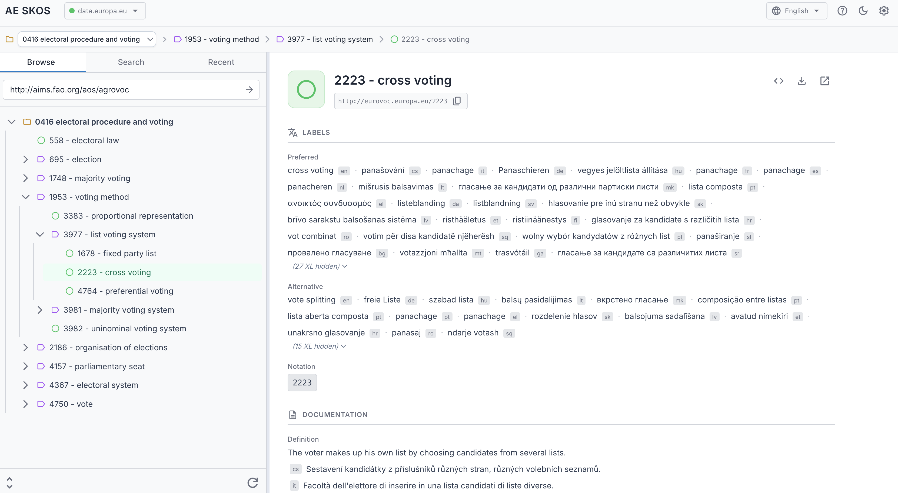

# AE SKOS

Browser-based SKOS vocabulary browser and explorer. Connect to any SPARQL endpoint and browse SKOS concept schemes directly in your browser.



## Features

- **Direct SPARQL Connection** - No backend required, connects directly to endpoints via Fetch API
- **Hierarchical Tree Browsing** - Navigate concept hierarchies with breadcrumb navigation
- **SKOS Collections** - Full support for nested collection hierarchies
- **Multi-language Support** - Automatic detection with configurable per-endpoint priorities
- **Advanced Search** - Autocomplete with regex, prefix match, and label scope options
- **Orphan Detection** - Find concepts not associated with any scheme
- **Concept Details** - View all properties, relations, and documentation
- **Deprecation Indicators** - Visual badges for deprecated concepts (OWL, EuroVoc)
- **Recent History** - Track and revisit recently viewed concepts across endpoints
- **Raw Data Views** - Inspect SPARQL queries and export RDF (Turtle, JSON-LD, etc.)
- **Dark Mode** - Toggle between light and dark themes
- **Desktop App** - Native builds for macOS, Windows, Linux via Tauri ([Download](https://github.com/cognizone/augmented-semantics/releases))

## Prerequisites

- Node.js 18+
- pnpm 9+
- A SPARQL endpoint with CORS enabled

## Getting Started

### Installation

```bash
# Clone the repository
git clone https://github.com/cognizone/augmented-semantics.git
cd augmented-semantics/ae-skos

# Install dependencies
pnpm install
```

### Development

```bash
# Start development server
pnpm dev
```

The app will be available at `http://localhost:5173`

### Build

```bash
# Type-check and build for production
pnpm build

# Preview production build
pnpm preview
```

### Desktop App (Tauri)

Build native desktop apps for macOS, Windows, and Linux:

```bash
# Development with hot reload
pnpm tauri:dev

# Production build
pnpm tauri:build
```

### Testing

```bash
# Run tests in watch mode
pnpm test

# Run tests once
pnpm test:run

# Run tests with coverage
pnpm test:coverage
```

## Usage

1. **Add an Endpoint** - Click the endpoint dropdown and add a SPARQL endpoint URL
2. **Select a Scheme** - Choose a concept scheme from the detected schemes
3. **Browse Concepts** - Navigate the hierarchy or use search to find concepts
4. **View Details** - Click any concept to see its full details

### Example Endpoints

| Name | URL |
|------|-----|
| DBpedia | `https://dbpedia.org/sparql` |
| Wikidata | `https://query.wikidata.org/sparql` |
| EU Publications | `https://publications.europa.eu/webapi/rdf/sparql` |

## Tech Stack

| Layer | Technology |
|-------|------------|
| Framework | Vue 3 + Composition API |
| Language | TypeScript (strict mode) |
| Build | Vite |
| State | Pinia |
| Routing | Vue Router |
| UI | PrimeVue |
| Testing | Vitest |

## Project Structure

```
ae-skos/
├── src/
│   ├── components/
│   │   ├── common/          # Shared components (EndpointManager, etc.)
│   │   └── skos/            # SKOS-specific components
│   ├── composables/         # Vue composables (useLabelResolver, etc.)
│   ├── services/            # SPARQL service, logger
│   ├── stores/              # Pinia stores (endpoint, language, settings)
│   ├── types/               # TypeScript type definitions
│   └── views/               # Route views
├── public/                  # Static assets
└── spec/                    # Specifications (in parent directory)
```

## Architecture

```
┌─────────────────────────────────────────────┐
│                  Browser                     │
│  ┌─────────────────────────────────────┐    │
│  │            AE SKOS App              │    │
│  │  ┌──────────┐  ┌──────────────────┐ │    │
│  │  │ Endpoint │  │   SKOS Browser   │ │    │
│  │  │ Manager  │  │   Components     │ │    │
│  │  └────┬─────┘  └────────┬─────────┘ │    │
│  │       │                 │           │    │
│  │       └────────┬────────┘           │    │
│  │                ▼                    │    │
│  │         SPARQL Service              │    │
│  └────────────────┬────────────────────┘    │
└───────────────────┼─────────────────────────┘
                    │ HTTP (Fetch API)
                    ▼
           ┌────────────────┐
           │ SPARQL Endpoint │
           │ (CORS enabled)  │
           └────────────────┘
```

## CORS Requirements

For browser-based direct connections, the SPARQL endpoint must have CORS enabled:

```
Access-Control-Allow-Origin: *
Access-Control-Allow-Methods: GET, POST, OPTIONS
Access-Control-Allow-Headers: Content-Type, Accept
```

Most public SPARQL endpoints (DBpedia, Wikidata, etc.) have CORS enabled by default.

## License

[Apache 2.0](../LICENSE)
