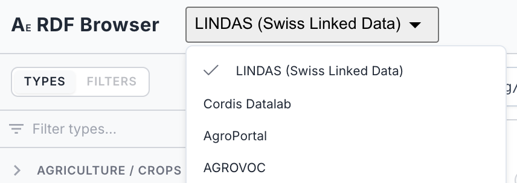

# Endpoints

AE RDF talks directly to SPARQL endpoints from your browser. On a **deployed instance** the available endpoints come from the app's bundled configuration (`config/app.json`): pick one from the header and connect. No data leaves your machine; queries go straight from the browser to the endpoint.

> **Deployed vs. authoring**: A deployed AE RDF runs in **config mode**, with its endpoint list fixed by `config/app.json`. Each tool ships its own config, so endpoints are **not** shared between AE SKOS and AE RDF. Adding, editing, testing, and authenticating endpoints is part of the **standalone / authoring** build, where you assemble the list you then export and deploy (see [The Endpoint Manager](configuration.md#the-endpoint-manager) and [Exporting a deployment config](configuration.md#exporting-a-deployment-config) in the Configuration Guide). To change the endpoints on a deployed instance, edit the config and redeploy.

## Choosing and switching endpoints

Click the endpoint badge in the header to open the endpoint menu, then pick one. Selecting an endpoint connects to it and (re)loads its [Types](02-browsing.md) sidebar. Switching later works the same way. The active endpoint is kept in the URL as a short slug, so a shared or bookmarked link opens on the right dataset (see [Shareable URLs](08-sharing.md)).

*The header endpoint dropdown, with a checkmark on the currently selected endpoint.*

## Adding your own endpoints

Custom endpoints, authentication, connection testing, and named-graph behaviour live in the **authoring build**, documented in the Configuration Guide:

- [The Endpoint Manager](configuration.md#the-endpoint-manager): add, edit, test, select, and remove endpoints
- [Adding a custom endpoint](configuration.md#adding-a-custom-endpoint): name and SPARQL URL
- [Authentication](configuration.md#authentication): Basic, API key, or Bearer token
- [Graph behaviour](configuration.md#graph-behaviour): named graphs (quads) and default view
- [Exporting a deployment config](configuration.md#exporting-a-deployment-config): bake your list into `config/app.json`
