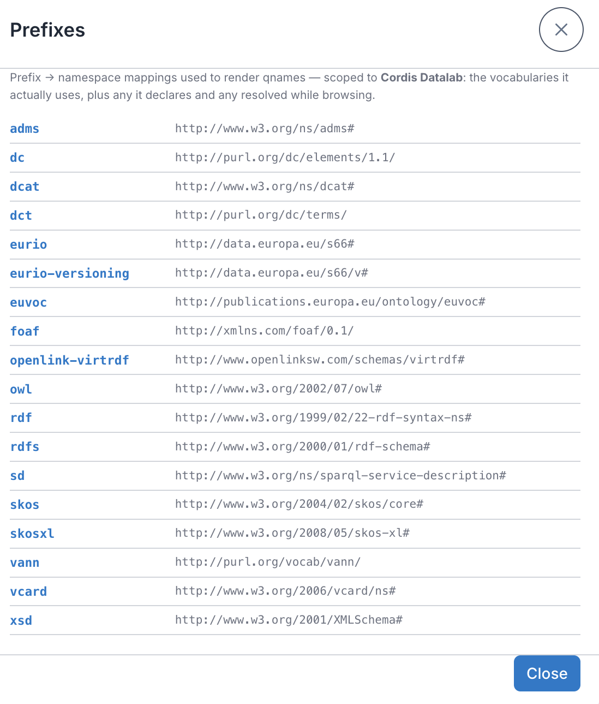

# Browsing

Once you're connected, AE RDF gives you two ways into the data: **browse by type**, or **jump straight to a URI**. Everything is a live query against the endpoint.

## Header toolbar

The header holds the app-wide controls:

| Button | | Description |
|--------|---|-------------|
| **Endpoint** | badge | Shows the active endpoint. Click to switch endpoints ([Endpoints](01-endpoints.md)); the endpoint manager (add / edit / test) is part of the [authoring build](configuration.md#the-endpoint-manager). |
| **SPARQL** |  | Opens the read-only SPARQL panel — run SELECT / ASK queries against the current endpoint. See [SPARQL panel](04-sparql.md). |
| **Documentation** |  | Opens the AE RDF documentation (this manual). |
| **Prefixes** |  | The active `prefix → namespace` mappings used to render qnames. |
| **Dark mode** |  | Toggle light/dark theme. |
| **Settings** |  | Display, sidebar behaviour, authoring mode, export, and build info. See [Settings](08-settings.md). |

The **Prefixes** dialog (the  button) lists the active `prefix → namespace` mappings, scoped to the current endpoint: the vocabularies it actually uses, plus any it declares and any resolved while browsing.

## Types sidebar

The left sidebar lists the dataset's `rdf:type`s, most common first, with a **distinct-instance count** next to each. Click any navigable type (including embedded ones) to list its instances in the main pane. Blank-node types, whose instances are anonymous nodes with no page, sit in the **Hidden** group and aren't clickable; you only ever see them inlined under a resource that uses them.

Type in the **Filter types…** box at the top to narrow the list by name; the header shows how many of the total types match.

It's a **tree**, not a flat list:

- **Subclasses** tuck under their general type. Where the data states one type is a kind of another (`rdfs:subClassOf`), it nests beneath it (e.g. `Result › ProjectPublication › JournalPaper`), indented, with a chevron to collapse or expand. Only relationships the data actually states are nested; if the endpoint doesn't declare them, the list stays flat.
- **Embedded value objects** nest under the class that uses them. A type set to render as **Embed** (see the [Configuration Guide](configuration.md#per-type-configuration)) appears beneath the class that composes it (e.g. `PublicBody › Site › PostalAddress`), marked with a `{}` icon, and its properties are inlined in the resource view. The count on a direct child is scoped to that class; for deeper ones, **hover** the row to fetch the exact path-scoped count.
- **Groups** collect types under a named, collapsible header (e.g. an "Ontology" group for schema classes).

Three groups are built in at the bottom, each collecting types by how they render as a *value* of another resource:

<table>
<tr>
<td width="50%" valign="top"><strong>Embedded</strong> (<code>{}</code> icon) Types rendered as <strong>Embed</strong>: their properties are pulled inline under the resources that reference them. Expanded by default. </td>
<td width="50%" valign="top"><strong>Value objects</strong> (tag icon) Types rendered as <strong>Label</strong>: shown as a single composed identity (e.g. a MonetaryAmount as <code>337472.95 · EUR</code>) rather than a browsable page. Collapsed by default. </td>
</tr>
</table>

The third group, **Hidden**, collects hidden types and blank-node types (collapsed by default).

A **warning icon on the Embedded group**, with a **red count** on a member, flags **orphaned** embedded instances: instances with no owner to inline them under, so they only ever appear in this group. Hover the count for the exact number. A high-cardinality entity showing a large red orphan count is usually a sign it shouldn't be set to Embed.

**Pinned** types float to the top, and configured types show small indicator icons (pinned, embedded, label). The **Types** header has **Types** and **Filters** tabs and a `{}` toggle that shows or hides embedded types nested under their class (they stay listed in the **Embedded** group either way):

Drag the sidebar's right edge to resize it, and the width is remembered.

Types are **configured** by a curator: pinned, hidden, grouped, or rendered as embedded value objects or labels, via a per-type gear in authoring mode (see the [Configuration Guide](configuration.md#per-type-configuration)). Without authoring mode the sidebar is read-only, but the configured effects still apply.

> **Counts are distinct** — Counts are the number of *distinct* subjects of that type. On large datasets the sidebar may take a few seconds to compute — that's the price of a correct count rather than an inflated one.

## Instance list

Selecting a type shows a paged list of its instances (25 per page), each with its best available label (falling back to the URI). Use the pager at the bottom to move through pages. Click an instance to open it.

*ProjectPublication as cards. The list header shows the type, a filter box, the **SPARQL** button, the table/card toggle, and the `1–25 of 419,740` page count.*

When a type configures [list columns](configuration.md#instance-list-columns), the list gains extra columns — the name plus one per configured property (e.g. a Project's acronym, status, start/end, total cost), each filled in just after the rows appear. Click any row to open it.

A **layout toggle** in the list header switches between a compact **table** and a **card** view (cards are the default — see [Settings](08-settings.md)); the toggle only appears for types that configure columns. Columns are **inherited down the subclass hierarchy** — configure a superclass (e.g. CORDIS `Result`) once and its subclasses (JournalPaper, ProjectPublication, …) show the same columns, unless a subclass sets its own.

*The same kind of list as a table (CORDIS Books): the name plus one column per configured property.*

### Filtering the list

A **filter box** sits above the list — type to narrow it to instances whose **name or URI** contains what you type. It matches the same label fields AE RDF uses to name things (a type's configured **label** fields if set, otherwise the usual `rdfs:label` / `skos:prefLabel` / `dcterms:title` / `foaf:name` family), plus the URI itself — so you can find a resource by a word in its title *or* by a fragment of its identifier.

- The filter runs against the **whole type on the server**, not just the current page — so it finds matches on page 40 without you paging there. The instance count updates to the filtered total.
- It's **debounced** — AE RDF waits until you pause typing before querying, so a fast typist doesn't fire a query per keystroke.
- Press **Esc** or the **✕** to clear it. The box stays visible as you switch types, so a filter is never a hidden constraint.

> **Custom search fields** — A type can pin exactly which predicates the filter searches via its **search** fields in the [config](configuration.md#per-type-configuration) — useful when the default label fields aren't what you want to match on.

### Facets

When a type has facets configured, the sidebar's header gains a **Filters** tab for narrowing the list by a property's values, numeric ranges, or dates (including values a hop or more away). See **[Faceted browsing](03-facets.md)** for the full rail.

### Open in SPARQL

Above the instance list, a **SPARQL** button hands the current filtered list — its type, graph scope, text filter, and every active facet — to the [SPARQL panel](04-sparql.md#open-in-sparql) as the exact query behind it, in a fresh tab.

### Unreferenced instances (orphans)

For a **value-object type** (one set to **Embed** with an owning predicate — e.g. a `PostalAddress` reached via `hasAddress`), an **Unreferenced** toggle appears. Turn it on to list just the instances that *no* resource points at through that predicate — the dangling value objects with no owner. It's off by default and resets when you switch types.

*The **Unreferenced** toggle on `OrganisationRole`, listing only the orphaned instances (the red counts in the Types sidebar's **Embedded** group).*

## The resource view

### Opening a resource URI

Paste a resource URI in the top bar and press **Go** to inspect it. If the URI belongs to a *different* configured dataset (matched against each endpoint's [`resourceNamespaces`](configuration.md#endpoint-configuration-file)), the app **switches to that endpoint automatically** and opens the resource there — a brief "Switched to …" note confirms the change. For example, pasting a `https://energy.ld.admin.ch/…` URI while on CORDIS switches to LINDAS and loads it. Deep links (a shared `?resource=` URL) switch the same way.

Opening an instance — or pasting a URI in the top bar and pressing **Go** — shows the resource:

- **Header** — the resource's label (or local name if it has none), its full URI (click it to dereference — opens in a new tab) with a copy  button next to it, plus its **type chips** and a [graph summary](06-graphs.md).
- **Type chips** — the resource's `rdf:type`s, lifted out of the property list. Click a chip to browse all instances of that type.
- **Attributes** — properties whose values are literals (dates, statuses, text), shown with language and datatype tags.
- **Relationships** — properties whose values are other resources. These are **clickable links**  — click to walk to that resource. Each link carries a small **type badge** showing the *most specific* type (e.g. `[JournalPaper]`, not the generic `[Result]`) so you can see exactly *what* it points at. Value-object types set to **Embed** (in the [Types gear](#types-sidebar)) show their properties inline instead of a link — e.g. a monetary amount renders as `value 1902.6 · currency EUR` in place, nested as deep as the data goes.

A property with a huge number of values (say a funding scheme linking thousands of grants) starts collapsed to a count with a **Show first 100** link, so the page stays manageable. Once expanded, a **filter box** appears above the values — type to narrow the list by name or URI (matched against every value, not just the 100 shown, since they're all already loaded). The status line reports how many match; **Esc** or the **✕** clears it.

Value objects can also render as a **Label** rather than embedded rows: a single composed identity in place (e.g. a `MonetaryAmount` as `337472.95 · EUR`), with no separate page. A link whose target has **no data** in the endpoint shows its bare local name with a warning marker (see [Readable values](#readable-values)). Properties the endpoint config **hides** are omitted; reveal them (greyed) with **Show hidden fields** in [Settings](08-settings.md).

*A CORDIS grant: labeled relationship links with type badges, a `MonetaryAmount` value object shown as `337472.95 · EUR`, and a dangling reference (`0c77a094…`) whose target has no data.*

### Referenced by (incoming links)

Relationships above point *outward*. To see what points **at** this resource — which grants fund it, which organisations are involved, which results it produced — expand the **Referenced by** section at the bottom. It loads on demand (incoming links can be huge), shows how many resources reference this one, and lists them grouped by predicate with an inbound **↤** marker. A URI referrer is a clickable link, so you can walk the graph *backwards* too; a **blank-node referrer** (e.g. an `owl:Restriction` that points here via `owl:onProperty`) has no page of its own, so its own properties are **inlined** in place — `onProperty … someValuesFrom Class` — rather than shown as a bare anonymous id. Very heavily-referenced resources show the first 1,000.

Within each section, properties are ordered by usefulness: labels and identifiers first, then dates, status, and the rest. Predicate names are humanized for readability (`dateEndApplicability` → "Date end applicability") — hover a predicate to see its real qname/URI.

### Readable values

Where a related resource has its own label, AE RDF shows it instead of an opaque code — so `MENV` reads as its full name when the endpoint provides one. A resource with **no** label shows its `prefix:LocalName` (distinct) plus a type badge, so several unlabeled links stay distinguishable. Objects under a predicate are sorted by their display text. A reference whose target has **no data at all** in the endpoint shows its bare local name with a **warning marker**, meaning that URI has no properties there, flagging a broken or incomplete link in the data.

Prefer raw URIs or prefixed qnames? Switch the **URI display** mode in [Settings](08-settings.md) — *Humanized names* (default), *Prefixed* (`skos:Concept`), or *Full URI*. It applies to predicates, links, and type names.

### Rich values (media, DOIs, geometry)

Certain values render richly rather than as bare links — inline images and audio/video players, **DOI ↗** badges with optional citation cards, and **map ↗** badges with optional embedded maps for WKT geometry. See **[Rich values](05-rich-values.md)**.

## Walking links & deep-linking

Clicking a relationship value opens that resource, and where you are — endpoint, type, resource, filters — is kept in the URL, so any view is bookmarkable and shareable and browser back/forward work. See **[Shareable URLs & deep-linking](07-sharing.md)**.
