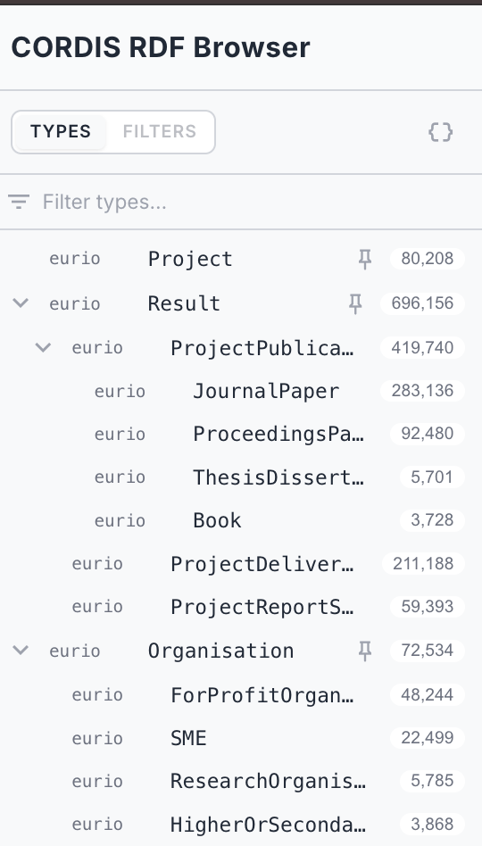
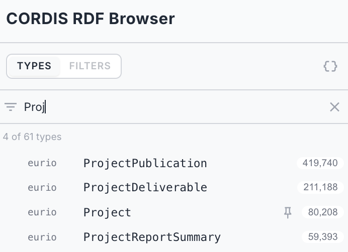
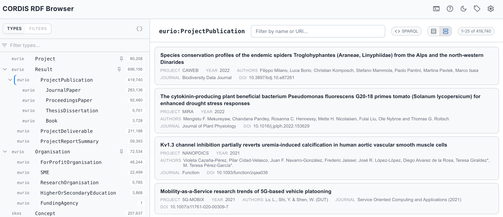
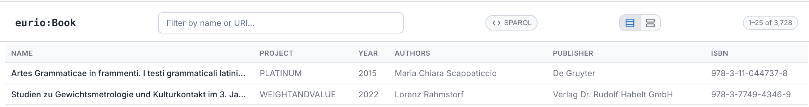
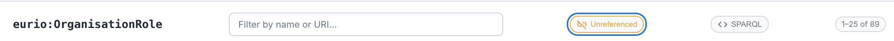

# Browsing

Once you're connected, AE RDF gives you two ways into the data: **browse by type**, or **jump straight to a URI**. Everything is a live query against the endpoint. This page covers finding your way around; reading a single resource is covered in [Resource view](03-resource-view.md).

## Header toolbar

The header holds the app-wide controls:

| Button | | Description |
|--------|---|-------------|
| **Endpoint** | badge | Shows the active endpoint. Click to switch endpoints ([Endpoints](01-endpoints.md)); the endpoint manager (add / edit / test) is part of the [authoring build](configuration.md#the-endpoint-manager). |
| **SPARQL** |  | Opens the read-only SPARQL panel for SELECT / ASK queries against the current endpoint. See [SPARQL panel](05-sparql.md). |
| **Documentation** |  | Opens the AE RDF documentation (this manual). |
| **Prefixes** |  | The active `prefix → namespace` mappings used to render qnames. |
| **Dark mode** |  | Toggle light/dark theme. |
| **Settings** |  | Display, sidebar behaviour, authoring mode, export, and build info. See [Settings](09-settings.md). |

The **Prefixes** dialog (the  button) lists the active `prefix → namespace` mappings, scoped to the current endpoint: the vocabularies it actually uses, plus any it declares and any resolved while browsing.

## Types sidebar

The left sidebar lists the dataset's `rdf:type`s, most common first, with a **distinct-instance count** next to each. Click any navigable type (including embedded ones) to list its instances in the main pane. Blank-node types, whose instances are anonymous nodes with no page, sit in the **Hidden** group and aren't clickable; you only ever see them inlined under a resource that uses them.

It's a **tree**, not a flat list:

- **Subclasses** tuck under their general type. Where the data states one type is a kind of another (`rdfs:subClassOf`), it nests beneath it (e.g. `Result › ProjectPublication › JournalPaper`), indented, with a chevron to collapse or expand. Only relationships the data actually states are nested; if the endpoint doesn't declare them, the list stays flat.
- **Value objects** nest under the class that uses them. A type set to render inline appears beneath the class that composes it (e.g. `PublicBody › Site › PostalAddress`). The count on a direct child is scoped to that class; for deeper ones, **hover** the row to fetch the exact path-scoped count.
- **Groups** collect types under a named, collapsible header (e.g. an "Ontology" group for schema classes).

Three groups are built in at the bottom, sorted by how a type renders as a *value* of another resource: **Embedded** (properties inlined, `{}` icon), **Value objects** (a single composed label, tag icon), and **Hidden** (hidden and blank-node types). See the [Configuration Guide](configuration.md#per-type-configuration) for how the render config drives these, what the icons mean, and the orphaned-instance warning.

Type in the **Filter types…** box at the top to narrow the type list by name; the header shows how many of the total types match.

**Pinned** types float to the top, and configured types show small indicator icons (pinned, embedded, label). The **Types** header has **Types** and **Filters** tabs and a `{}` toggle that nests embedded types under their class (they stay listed in the **Embedded** group either way). Drag the sidebar's right edge to resize it, and the width is remembered.

Types are **configured** by a curator: pinned, hidden, grouped, or rendered as embedded value objects or labels, via a per-type gear in authoring mode (see the [Configuration Guide](configuration.md#per-type-configuration)). Without authoring mode the sidebar is read-only, but the configured effects still apply.

> **Counts are distinct**: counts are the number of *distinct* subjects of that type. On large datasets the sidebar may take a few seconds to compute; that's the price of a correct count rather than an inflated one.

## Instance list

Selecting a type shows a paged list of its instances (25 per page), each with its best available label (falling back to the URI). Use the pager at the bottom to move through pages. Click an instance to open it.

*ProjectPublication as cards. The list header shows the type, a filter box, the **SPARQL** button, the table/card toggle, and the `1–25 of 419,740` page count.*

When a type configures [list columns](configuration.md#instance-list-columns), the list gains extra columns: the name plus one per configured property (e.g. a Project's acronym, status, start/end, total cost), each filled in just after the rows appear. Click any row to open it.

A **layout toggle** in the list header switches between a compact **table** and a **card** view (cards are the default, see [Settings](09-settings.md)); the toggle only appears for types that configure columns. Columns are **inherited down the subclass hierarchy**: configure a superclass (e.g. CORDIS `Result`) once and its subclasses (JournalPaper, ProjectPublication, …) show the same columns, unless a subclass sets its own.

*The same kind of list as a table (CORDIS Books): the name plus one column per configured property.*

### Filtering the list

A **filter box** sits above the list: type to narrow it to instances whose **name or URI** contains what you type. It matches the same label fields AE RDF uses to name things (a type's configured **label** fields if set, otherwise the usual `rdfs:label` / `skos:prefLabel` / `dcterms:title` / `foaf:name` family), plus the URI itself, so you can find a resource by a word in its title *or* by a fragment of its identifier.

- The filter runs against the **whole type on the server**, not just the current page, so it finds matches on page 40 without you paging there. The instance count updates to the filtered total.
- It's **debounced**: AE RDF waits until you pause typing before querying, so a fast typist doesn't fire a query per keystroke.
- Press **Esc** or the **✕** to clear it. The box stays visible as you switch types, so a filter is never a hidden constraint.

> **Custom search fields**: a type can pin exactly which predicates the filter searches via its **search** fields in the [config](configuration.md#per-type-configuration), useful when the default label fields aren't what you want to match on.

### Facets

When a type has facets configured, the sidebar's header gains a **Filters** tab for narrowing the list by a property's values, numeric ranges, or dates (including values a hop or more away). See **[Faceted browsing](04-facets.md)** for the full rail.

### Open in SPARQL

Above the instance list, a **SPARQL** button hands the current filtered list (its type, graph scope, text filter, and every active facet) to the [SPARQL panel](05-sparql.md#open-in-sparql) as the exact query behind it, in a fresh tab.

### Unreferenced instances (orphans)

For a **value-object type** (one set to **Embed** with an owning predicate, e.g. a `PostalAddress` reached via `hasAddress`), an **Unreferenced** toggle appears. Turn it on to list just the instances that *no* resource points at through that predicate, the dangling value objects with no owner. It's off by default and resets when you switch types.

*The **Unreferenced** toggle on `OrganisationRole`, listing only the orphaned instances (the red counts in the Types sidebar's **Embedded** group).*
