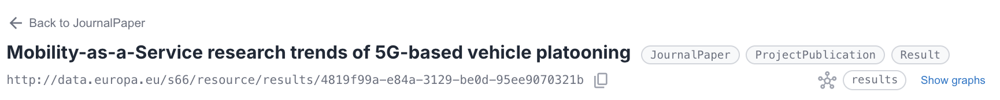
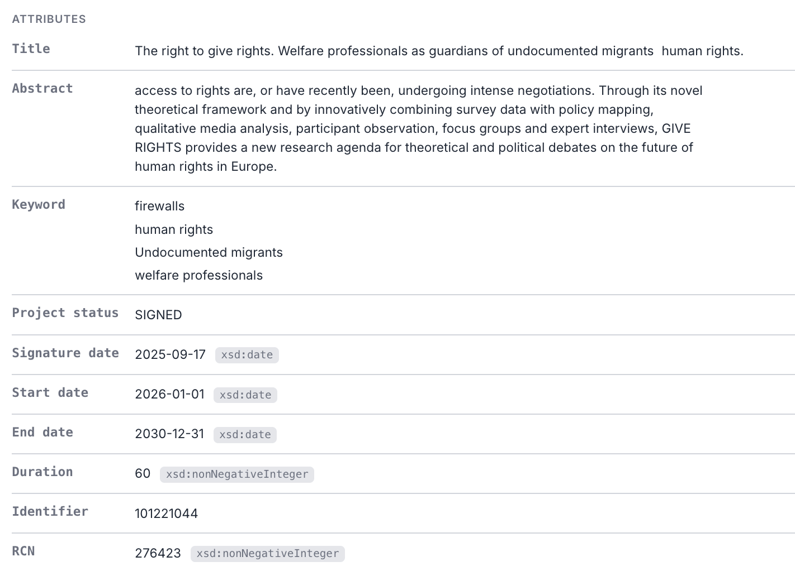

# Resource view

Opening a resource shows everything AE RDF knows about it: its attributes, the resources it links to, and the resources that link back. Every part is a live query against the endpoint.

## Opening a resource URI

Paste a resource URI in the top bar and press **Go** to inspect it. If the URI belongs to a *different* configured dataset (matched against each endpoint's [`resourceNamespaces`](configuration.md#endpoint-configuration-file)), the app **switches to that endpoint automatically** and opens the resource there, with a brief "Switched to …" note confirming the change. For example, pasting a `https://energy.ld.admin.ch/…` URI while on CORDIS switches to LINDAS and loads it. Deep links (a shared `?resource=` URL) switch the same way.

## Attributes and relationships

Opening an instance (from a list, a link, or the top bar) shows the resource.

The **header** gives the resource's label (or local name if it has none), its full URI (click it to dereference, opens in a new tab) with a copy  button, its **type chips** (most specific first; click one to browse all instances of that type), and a [graph summary](07-graphs.md).

**Attributes** are properties whose values are literals (dates, statuses, text), each shown with its language or datatype tag.

**Relationships** are properties whose values are other resources. How each value renders depends on the target type's [render config](configuration.md#per-type-configuration):

- **Link** (default): a clickable link  to that resource, shown with its label and a **type badge** for the *most specific* type (e.g. `[Concept]`).
- **Label**: a value object shown as a single composed identity in place (e.g. an `Acronym` as `GIVE RIGHTS`, a `MonetaryAmount` as `1499837 · EUR`). It still links to the object, which has no page worth browsing on its own.
- **Embed**: a value object with its own properties inlined in place (e.g. a `Grant` showing its start date, end date, and beneficiary), nested as deep as the data goes.

A property with a huge number of values (say a funding scheme linking thousands of grants) starts collapsed to a count with a **Show first 100** link, so the page stays manageable. Once expanded, a **filter box** appears above the values: type to narrow the list by name or URI (matched against every value, not just the 100 shown, since they're all already loaded). The status line reports how many match; **Esc** or the **✕** clears it.

A link whose target has **no data** in the endpoint shows its bare local name with a warning marker (see [Readable values](#readable-values)). Properties the endpoint config **hides** are omitted; reveal them (greyed) with **Show hidden fields** in [Settings](09-settings.md).

## Referenced by (incoming links)

Relationships above point *outward*. To see what points **at** this resource (which grants fund it, which organisations are involved, which results it produced), expand the **Referenced by** section at the bottom. It loads on demand (incoming links can be huge), shows how many resources reference this one, and lists them grouped by predicate with an inbound **↤** marker. A URI referrer is a clickable link, so you can walk the graph *backwards* too; a **blank-node referrer** (e.g. an `owl:Restriction` that points here via `owl:onProperty`) has no page of its own, so its own properties are **inlined** in place (`onProperty … someValuesFrom Class`) rather than shown as a bare anonymous id. Very heavily-referenced resources show the first 1,000.

Within each section, properties are ordered by usefulness: labels and identifiers first, then dates, status, and the rest. Predicate names are humanized for readability (`dateEndApplicability` becomes "Date end applicability"); hover a predicate to see its real qname/URI.

## Readable values

Where a related resource has its own label, AE RDF shows it instead of an opaque code, so `MENV` reads as its full name when the endpoint provides one. A resource with **no** label shows its `prefix:LocalName` (distinct) plus a type badge, so several unlabeled links stay distinguishable. Objects under a predicate are sorted by their display text. A reference whose target has **no data at all** in the endpoint shows its bare local name with a **warning marker**, meaning that URI has no properties there, flagging a broken or incomplete link in the data.

Prefer raw URIs or prefixed qnames? Switch the **URI display** mode in [Settings](09-settings.md): *Humanized names* (default), *Prefixed* (`skos:Concept`), or *Full URI*. It applies to predicates, links, and type names.

## Rich values (media, DOIs, geometry)

Certain values render richly rather than as bare links: inline images and audio/video players, **DOI ↗** badges with optional citation cards, and **map ↗** badges with optional embedded maps for WKT geometry. See **[Rich values](06-rich-values.md)**.

## Follow links and share

Clicking a relationship value opens that resource, and where you are (endpoint, type, resource, filters) is kept in the URL, so any view is bookmarkable and shareable and browser back/forward work. See **[Shareable URLs and deep-linking](08-sharing.md)**.
