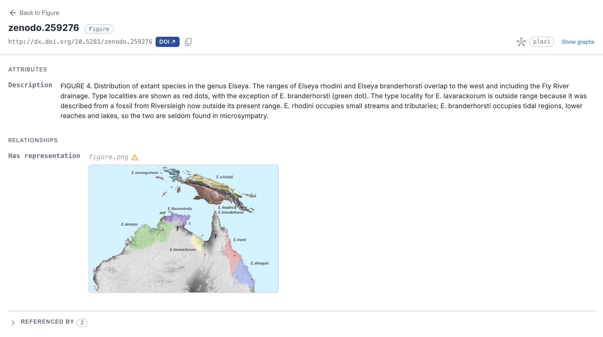
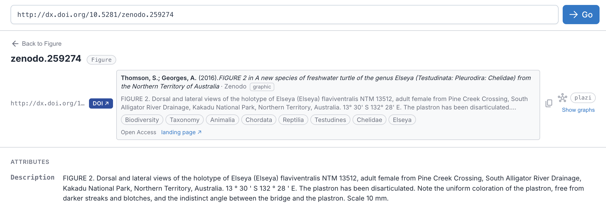
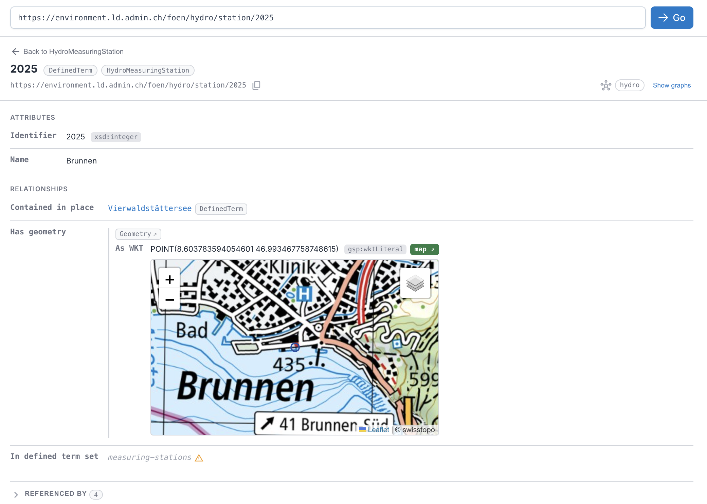

# Rich values (media, DOIs, geometry)

AE RDF recognises what certain values *are* and shows them richly, not just as links, in the [resource view](02-browsing.md#the-resource-view) and anywhere a value appears.

## Media files

A value (or a viewed resource) whose URL is an image, video, or audio file renders **inline**: images as a thumbnail (click to open full size in a new tab), video/audio with player controls. Detected by file extension, `http(s)` only.

*A media value (`figure.png`) rendered inline as a thumbnail. Click it to open full size in a new tab.*

## DOIs

A DOI in any form (a `doi.org` URL, `doi:10.…`, or a bare `10.…/…` literal) gets a blue **DOI ↗** badge linking to the resolver. With the **DOI citations** [setting](09-settings.md) on, an inline **citation card** appears as the value scrolls into view: authors, year, title, publisher, subject categories, a truncated abstract, and a landing-page link, fetched from doi.org on demand and cached. If a registrar has no metadata, the badge simply stays a link. Deployers can toggle individual card fields via the [`doi` config section](configuration.md#appjson-reference).

*A DOI rendered as a citation card, fetched from doi.org on demand: authors, year, title, publisher, subject categories, abstract, and a landing-page link.*

## Geometry (WKT)

A `geo:wktLiteral` value gets a green **map ↗** badge opening the location on OpenStreetMap. With the **Geometry maps** [setting](09-settings.md) on, an **embedded map** renders the point/line/polygon itself: swisstopo basemap for Swiss coordinates, OpenStreetMap elsewhere, switchable in the map's corner. Only WGS84 (longitude/latitude) coordinates are mapped; projected coordinates (e.g. Swiss LV95) show the raw value, never a wrong pin.

*A `geo:wktLiteral` rendered inline as a map. See it live → [a LINDAS hydro station, mapped](https://cognizone.github.io/augmented-semantics/rdf/?resource=https%3A%2F%2Fenvironment.ld.admin.ch%2Ffoen%2Fhydro%2Fstation%2F2025), the multi-endpoint edition auto-switches to LINDAS.*

## Privacy

> **Off by default, lazy by design**: The two features that call external services (DOI citations and geometry maps) are **off by default** and fetch lazily (only what you actually scroll to), so browsing stays private and light unless you opt in. Turn them on in [Settings](09-settings.md) (**DOI citations** and **Geometry maps**); deployers can preset them via the [configuration guide](configuration.md#appjson-reference).
