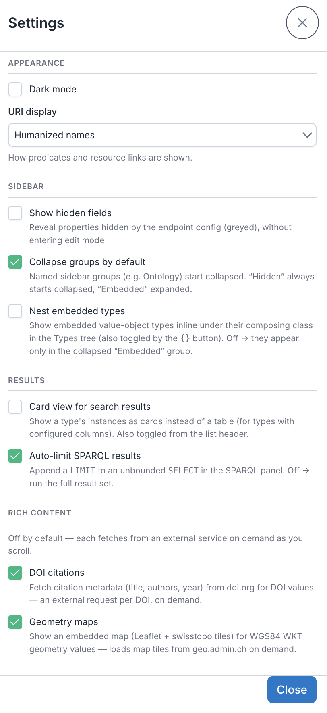

# Settings

Open the settings dialog from the  button in the header. Settings are saved in your browser (localStorage).

- **Dark mode** — toggle light/dark theme.
- **URI display** — how predicates, links, and type names render:
  - *Humanized names* (default) — friendly labels (e.g. "Date end applicability").
  - *Prefixed* — compact qnames (e.g. `skos:Concept`).
  - *Full URI* — the raw IRI.
- **Show hidden fields** — reveal properties hidden by the endpoint config (shown greyed), without entering authoring mode.
- **Collapse groups by default** — named sidebar groups (e.g. "Ontology") start collapsed. The built-in **Hidden** group always starts collapsed and **Embedded** always starts expanded, regardless of this setting.
- **Nest embedded types** — off by default. When on, embedded value-object types show nested inline under their composing class in the Types tree (also toggled by the `{}` button in the Types header). Off → they appear only in the collapsed **Embedded** group.
- **Card view for search results** — on by default. Shows a type's instances as cards instead of a table (for types with [configured columns](02-browsing.md#instance-list)); also toggled from the list header.
- **Auto-limit SPARQL results** — on by default. Appends a `LIMIT` to an unbounded `SELECT` in the [SPARQL panel](05-sparql.md); turn off to run the full result set.
- **DOI citations** — off by default. When on, DOI values show an inline citation card (authors, year, title, …) fetched from doi.org on demand — an external request per DOI you scroll to. See [Rich values](06-rich-values.md).
- **Geometry maps** — off by default. When on, WKT geometry values render an embedded map (swisstopo / OpenStreetMap tiles — external tile requests). See [Rich values](06-rich-values.md).
- **Config authoring mode** — off by default (clean, read-only browsing). Turn it on to reveal the per-type gears in the Types sidebar and the export buttons below. The configured effects (embed/hide/pin) apply either way; this just shows the editing tools. Authoring — per-type configuration, graph behaviour, and exporting a deployment config — is covered in the [Configuration Guide](configuration.md).
