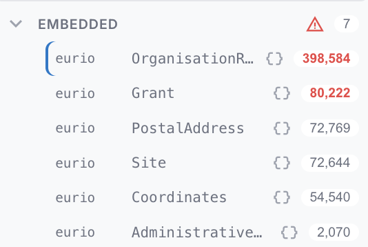
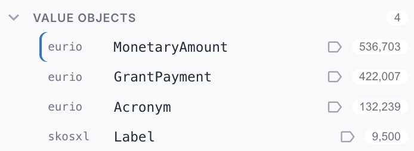
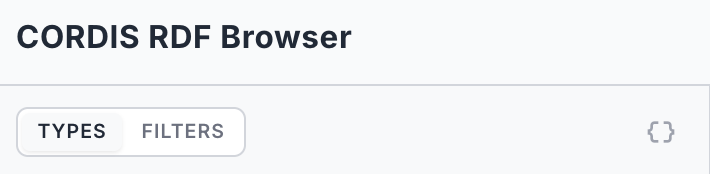

# Configuration Guide

This page is for **curators and deployers**: people who shape how a deployed AE RDF looks — which types are visible, how value objects render, how the endpoint behaves — and then export that as a locked configuration for end users. For day-to-day browsing, see the [User Guide](index.md#user-guide).

## Authoring mode

Everything on this page happens in **Config authoring mode** — a toggle in [Settings](09-settings.md), off by default. Turning it on reveals the per-type gears in the Types sidebar and the export buttons; the configured effects (embed/hide/pin) apply either way. The gear and **Export** stay available even when running a deployed config, so you can tweak and re-export.

## The Endpoint Manager

In the standalone / authoring build you assemble the endpoint list by hand. Open the manager from the endpoint badge in the header, then **Manage endpoints…**. From here you can add, edit, test, select, and remove endpoints. (A deployed instance has no manager: its list is fixed by `config/app.json`, and a custom URL you type there lasts only for the current session. See [Exporting a deployment config](#exporting-a-deployment-config).)

- **Suggested endpoints**: curated public endpoints appear as one-click entries. Click one to add and connect to it immediately.
- **Add endpoint**: opens a small form for a custom endpoint (below).
- Each saved endpoint shows a status dot (green = currently selected) and **edit** / **delete** actions. Delete asks for a quick confirm.

Selecting an endpoint connects to it and loads its [type inventory](02-browsing.md). The edit form also has a **Graph behaviour** section, covered in [Graph behaviour](#graph-behaviour) below.

### Adding a custom endpoint

The form needs just two things:

| Field | Notes |
|-------|-------|
| **Name** | A label for your own reference. |
| **SPARQL endpoint URL** | The full query URL, e.g. `https://example.org/sparql`. |

A warning appears if the URL is plain `http://` (your queries could be intercepted): fine for `localhost`, risky for public endpoints.

### Authentication

If the endpoint is protected, choose an **Authentication** type:

| Type | Fields |
|------|--------|
| None | (default) |
| Basic | Username + password |
| API key | Header name + key |
| Bearer token | Token |

Credentials are **never saved**: leave them blank and AE RDF asks for them when it connects, holding them in memory for that session only. They're sent only to the endpoint, with each query. The endpoint file stores only the auth *type* (see [Endpoint configuration file](#endpoint-configuration-file)).

### Test before saving

Click **Test** to run a tiny `SELECT … LIMIT 1` against the endpoint. You'll get a green success (with response time) or a clear error, most often a [CORS](10-troubleshooting.md#cors-the-endpoint-wont-load) or authentication problem. Then **Save**.

## Per-type configuration

Turn on **Config authoring mode** in [Settings](09-settings.md) to reveal a per-type **gear** in the Types sidebar:

- **Pin** to the top, or **Hide** (hidden types move into the **Hidden** group, where you can unhide them).
- **Render as object** — how it shows when it's a *value* of another resource: **Link** (default), **Embed** (inline its properties — for value objects like amounts, addresses, coordinates), or **Label only**.
- **Group** — assign to an existing group, create a new one, or remove.

Without authoring mode the sidebar is read-only, but the configured effects still apply.

### System groups and sidebar icons

Types are collected into three built-in groups at the bottom of the Types sidebar by their **render** strategy, each with its own icon:

<table>
<tr>
<td width="50%" valign="top"><strong>Embedded</strong> (<code>{}</code> icon)<br>Types with <code>render: embed</code>: their properties are inlined under the resources that reference them. Expanded by default.<br></td>
<td width="50%" valign="top"><strong>Value objects</strong> (tag icon)<br>Types with <code>render: label</code>: shown as a single composed identity (e.g. a MonetaryAmount as <code>337472.95 · EUR</code>) rather than a browsable page. Collapsed by default.<br></td>
</tr>
</table>

The third group, **Hidden**, collects hidden and blank-node types (collapsed by default). The **Types** header has a `{}` toggle that also nests embedded types under their composing class; either way they stay listed in the **Embedded** group.



A **warning icon on the Embedded group**, with a **red count** on a member, flags **orphaned** embedded instances: instances with no owner to inline them under (see [Embedding safely](#embedding-safely)), so they only ever appear in the group. Hover the count for the exact number; a high-cardinality entity with a large red orphan count usually should not be set to `embed`.

### Type config reference

Everything the gear (and the resource-view edit tools) author lands in the endpoint's `types` map, keyed by type IRI:

| Field | Meaning |
|-------|---------|
| `render` | How an instance shows as a *value*: `link` (default), `embed` (inline its properties), `label` (identity only, no navigation — for shared value objects like unit vocabularies). |
| `embedVia` | For `render: embed` — only inline the object where it's reached via **this** predicate (its owning relationship). `^predicate` inverts it (embed the referrer). |
| `sidebar` | `show` / `hide` / `pin`. |
| `group` | Sidebar group label — types with the same label collect under one collapsible header. |
| `order` | Predicate IRIs in display order for this type's resource view. |
| `hide` | Predicate IRIs hidden from the resource view. |
| `label` / `labelFull` | Predicates composing the display label; `labelFull` keeps all parts in the heading. |
| `search` | Predicates the instance-list filter matches (overrides the default label fields). |
| `facets` | [Faceted-browsing](#facets) filters for the instance list — one entry per faceted property (value or range). Config-file-authored only. |
| `listColumns` | Extra [columns](#instance-list-columns) in this type's instance list — one entry per column (`predicate`, optional `label`, optional `via` path). Turns the plain list into a small table. Config-file-authored only. |
| `foldAfter`, `groupByType`, `boolean`, `number`, `columns`, `capWidth`, `viaLabels` | Per-field display formatting, all authored via the gear/edit tools. |

### Embedding safely

`render: embed` inlines an object's properties recursively — use it for **low-cardinality value objects** (amounts, addresses, coordinates, time instants, geometries). Two rules keep it safe:

- **Never blanket-embed a high-cardinality type.** A resource pointing at hundreds of embedded objects inlines them all; the loader caps depth and total, but the page becomes a wall. Check the worst-case *copies under a single parent* (the profiler records this as `embed.selfMax` in `typeProperties`) — single digits is fine, hundreds is not.
- **Scope with `embedVia`.** Many value objects are *also* the range of a high-fan-out predicate (a "defined term" list, a shared unit). Pinning the owning predicate means the object only inlines under its owner, and everywhere else stays a link. For genuinely shared vocabulary terms, prefer `render: label` over embed.

### Facets

A type can expose **faceted filters** in the sidebar's **Filters** tab (next to **Types**): click values to narrow the instance list without typing. Facets are **config-file-authored** — there's no gear for them in v1. Add a `facets` array to the type's config, one entry per faceted property:

- **Value facet** (no `ranges`) — lists that property's distinct values, most common first, each with a count. Clicking values narrows the list; multi-select within one facet is **OR**, and selecting across several facets is **AND**. `limit` caps how many values are listed (default 15; a "top N shown" note appears when there are more). URI values are shown with their resolved label; literals as-is.
- **Range facet** (`ranges` set) — buckets a numeric property into the bands you define (`min` ≤ value < `max`; either bound may be omitted for an open-ended band). Each band shows a count. By default the value is compared numerically (a decimal cast, so a number stored as a string still sorts right). Set **`datatype: "date"`** to treat each band's `min`/`max` as a **year** and compare the value as an `xsd:date` (`≥ "min-01-01"`, `< "max-01-01"`) — a year/date range facet.
- **Two-hop value** (`via` set) — when the faceted value lives one node away (a wrapper node, not a direct literal), give the second-hop predicate in **`via`**: the facet then matches `?s <predicate> ?node . ?node <via> ?value` and facets on `?value`. Works for both value and range facets. Example: CORDIS `hasTotalCost` points at a `MonetaryAmount` node whose number is under `value`, so `predicate: hasTotalCost, via: value` ranges over the actual cost.

A facet's own counts are computed with the **other** facets' selections applied but not its own — so an unselected value always shows what *adding* it would yield (classic faceted search). The instance list and its total reflect **all** selections. A **Clear filters** link resets them. Selections are saved in the URL (`?filters=`), so a filtered list is bookmarkable and shareable.

```json
{
  "types": {
    "http://data.europa.eu/s66#Grant": {
      "facets": [
        {
          "predicate": "http://data.europa.eu/s66#status",
          "label": "Status",
          "limit": 10
        },
        {
          "predicate": "http://data.europa.eu/s66#totalCost",
          "label": "Total cost",
          "ranges": [
            { "label": "< €100k", "max": 100000 },
            { "label": "€100k – €1M", "min": 100000, "max": 1000000 },
            { "label": "≥ €1M", "min": 1000000 }
          ]
        }
      ]
    }
  }
}
```

### Instance-list columns

By default the instance list shows each row's name (label) and URI. Give a type a **`listColumns`** array and the list becomes a small **table**: the name plus one column per entry, each showing that property's value for the row. It's the same `via` path mechanism as facets, so a column can reach a value one or more hops away (a wrapper node like `hasTotalCost` → `value`, or an acronym node's `shortForm`).

Each column: `predicate` (the property, first hop when `via` is set), optional `label` (heading; defaults to the humanized predicate name), optional `via` (a single predicate or an ordered path array). One value per cell (sampled — meant for near-functional properties like status, dates, amounts); URI values render as a qname, literals as-is. Cells fill in just after the rows appear.

Users can switch a columned list between a **table** and a **card** layout from the list header (cards by default). Columns **inherit down the subclass hierarchy**: a type with no `listColumns` of its own uses the nearest ancestor's (via the `subclasses` map), so you configure a superclass (e.g. `Result`) once and its subclasses (JournalPaper, ProjectPublication, …) get the same columns unless they set their own.

```json
{
  "types": {
    "http://data.europa.eu/s66#Project": {
      "listColumns": [
        { "predicate": "http://data.europa.eu/s66#hasAcronym", "via": "http://data.europa.eu/s66#shortForm", "label": "Acronym" },
        { "predicate": "http://data.europa.eu/s66#projectStatus", "label": "Status" },
        { "predicate": "http://data.europa.eu/s66#startDate", "label": "Start" },
        { "predicate": "http://data.europa.eu/s66#hasTotalCost", "via": "http://data.europa.eu/s66#value", "label": "Total cost" }
      ]
    }
  }
}
```

## Endpoint configuration file

A deployed endpoint (`config/endpoints/<slug>.json`, or embedded in `app.json`) carries, besides `name` and `url`:

| Field | Meaning |
|-------|---------|
| `auth` | Authentication *type* (basic / apikey / bearer). Credentials are never stored — users are prompted on connect. |
| `graph` | [Graph behaviour](#graph-behaviour): `quads` and `defaultView` (`own` / `merged`). |
| `infer` | GraphDB only: send `infer=<value>` with every query (`false` disables inferred triples). |
| `types` | The per-type config map (above). |
| `prefixes` | Endpoint-declared `prefix → namespace` map, loaded at highest precedence while this endpoint is active — keeps exotic-vocab qnames readable without bloating the global `app.json` prefixes. |
| `resourceNamespaces` | URI prefixes whose **resources** this endpoint serves (its data hosts, e.g. `https://energy.ld.admin.ch/` for LINDAS, `http://data.europa.eu/s66/` for CORDIS). Drives [URL auto-switch](02-browsing.md#opening-a-resource-uri): entering/opening a resource URI under one of these switches the active endpoint to this one and loads the resource there. Distinct from `prefixes`, which only shapes qname *display* for vocabularies. |
| `extraLabelPredicates` | Extra label predicates appended at lowest precedence (e.g. `foaf:name` / `schema:name` for endpoints that label agents only via those). |
| `typeInventory`, `typeProperties`, `subclasses`, `composition`, `orphanCounts`, `deprecatedPredicates`, `profiledAt` | Cached profiler output for an instant sidebar and informed embedding — generated, not hand-written (see the script below). |

## app.json reference

The manifest at `config/app.json`:

| Field | Meaning |
|-------|---------|
| `appName`, `logoUrl`, `documentationUrl` | Branding: header name, logo, and docs link. |
| `endpoints` | The endpoint list — inline objects and/or `"<slug>"` strings referencing `config/endpoints/<slug>.json`. |
| `prefixes` | Global `prefix → namespace` map (shared across endpoints). |
| `doi` | Per-field toggles for the [DOI citation card](06-rich-values.md#rich-values-media-dois-geometry): `authors`, `year`, `title`, `container`, `publisher`, `type`, `categories`, `abstract`, `copyright`, `url` (omitted = shown; `false` hides) and `abstractMaxChars` (truncation length, default 280). |

## Generating groups, embeds & prefixes (`group-types.mjs`)

Hand-assigning groups to hundreds of classes doesn't scale. `ae-rdf/scripts/group-types.mjs` writes them into a profiled endpoint config:

```bash
node scripts/group-types.mjs public/config/endpoints/<slug>.json [flags]
```

| Flag | Effect |
|------|--------|
| *(none)* | Mechanical clustering: well-known vocabularies get canonical group names; everything else groups by dataset (host + path), oversized groups split a path segment deeper, tiny groups fold into their dominant linker. |
| `--smart` | Sends the inventory (class URIs, counts, property-range links) to Claude (`claude -p`) for **thematic** clustering — classes group by what they mean and link to, not just their namespace. The mechanical pass remains the fallback for anything uncovered. |
| `--embed` | Marks a curated list of well-known value objects (`schema:PostalAddress`, `time:Instant`, `geo:Geometry`, …) `render: embed`, gated by the profiler's `selfMax` so a fan-out type is refused loudly. |
| `--prefixes` | Generates the endpoint's `prefixes` map (conventional prefixes for known vocabularies, sensible guesses for the rest). |
| `--dry-run` | Report only, write nothing. |
| `--force` | Overwrite existing `group` / `render` / `prefixes` values (default: hand-authored values win). |

It requires a profiled config (`typeInventory` + `typeProperties`); run the profiler first (`scripts/profile-endpoint.ts`).

## Graph behaviour

With [Config authoring mode](09-settings.md) on, the endpoint edit form gains a **Graph
behaviour** section: whether the endpoint uses **named graphs (quads)** and what
its **default (no-`GRAPH`) view** is — *Own* triples or a *Merged* view of the
quads. Leave both **Auto** unless you know the endpoint; see [Graphs](07-graphs.md).
It's saved with the endpoint and exported in `app.json`.

## Exporting a deployment config

With authoring mode on, two export buttons appear under **Deployment**:

- **Export app.json** — the manifest: app name, prefix mappings (so qnames render offline, without prefix.cc), and the endpoint list. Each endpoint carries its graph behaviour, per-type config (sidebar visibility, embed/link/label, order), and a cached snapshot of the type inventory (for an instant Types sidebar on deploy).
- **Export &lt;endpoint&gt;** — the currently selected endpoint as its own file.

To deploy: drop the manifest at `config/app.json`. Endpoints can be embedded in the manifest, or split into `config/endpoints/<slug>.json` files referenced from the manifest by slug — export each with the per-endpoint button and add its slug to the manifest's `endpoints` list. Tweak everything live, export, deploy, and end users get a pre-configured, locked AE RDF. **Credentials are never included in any export.**
