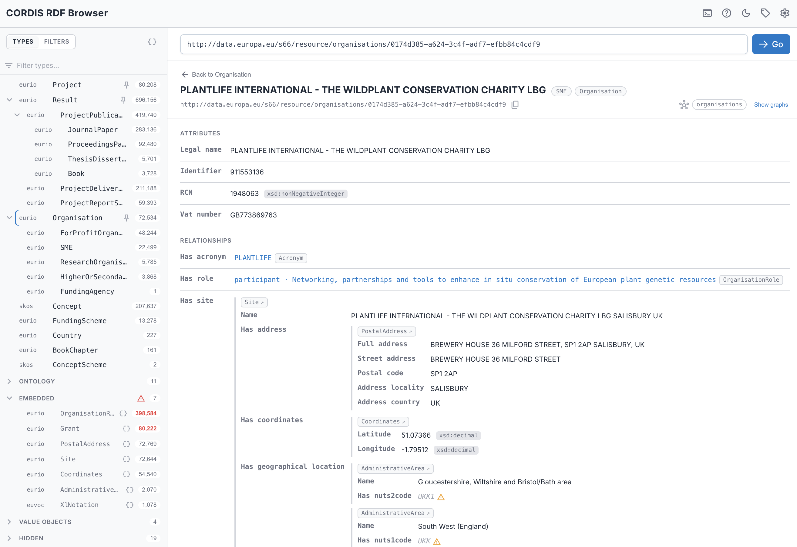

# AE RDF User Manual

> **Try it now** — [Open AE RDF](https://cognizone.github.io/augmented-semantics/rdf/) in your browser, no installation required.

A fast, browser-only explorer for **any** RDF dataset behind a SPARQL endpoint. Connect, see what types of things exist, drill into a type's instances, open any resource, and follow its links — all live, all in your browser. No backend, no precomputed indexes, no data leaves your machine.

*See it live → [this organisation in the CORDIS edition](https://cognizone.github.io/augmented-semantics/rdf-cordis/?type=http://data.europa.eu/s66%23Organisation&resource=http://data.europa.eu/s66/resource/organisations/0174d385-a624-3c4f-adf7-efbb84c4cdf9) — the exact view above, live.*

> **Live queries only** — AE RDF runs entirely on live SPARQL: no backend, no precomputed indexes, no data leaves your machine. Endpoint connection, type discovery, instance lists, the resource view with incoming links, and everything in **Highlights** below all run as live queries against the endpoint.

## Highlights

| Feature | What it does |
|---------|--------------|
| **[Faceted browsing](03-facets.md)** | Filter a type by its values, numeric ranges, and dates — even values several hops away — with live, self-adjusting counts. |
| **[SPARQL panel](04-sparql.md)** | A read-only query console: many named tabs, auto-`LIMIT`, paginated results, and portable prefixed queries. |
| **[Rich values](05-rich-values.md)** | Media files inline, DOI citation cards, and embedded maps for WKT geometry. |
| **[Graph provenance](06-graphs.md)** | Always know which named graph every fact comes from. |
| **[Shareable URLs](07-sharing.md)** | Endpoint, type, resource, and filters live in the URL — bookmark, share, and step through with back/forward. |
| **[Instance views](02-browsing.md#instance-list)** | Per-type columns in a table or card layout, with server-side text filtering. |

> **Want your endpoint on the list?** If you maintain a public SPARQL endpoint and would like it included as a suggested endpoint, [open an issue on GitHub](https://github.com/cognizone/augmented-semantics/issues).

## Getting Started

AE RDF connects directly to SPARQL endpoints from your browser — the endpoint must allow browser access ([CORS](09-troubleshooting.md#cors-the-endpoint-wont-load)).

### Quick Start

1. Open the endpoint menu in the header and pick an endpoint. (In the standalone / authoring build you can also **Add endpoint** for a custom URL — see [Managing Endpoints](01-endpoints.md).)
2. Once connected, the **Types** sidebar lists every `rdf:type` in the dataset with an instance count.
3. Click a type to see its instances, then click an instance to open it.
4. Or paste any **resource URI** into the bar at the top and press **Go**.

On a deployed instance the endpoints come from the app's bundled configuration; AE SKOS and AE RDF each ship their own, so the endpoint lists are **not** shared between the tools.

## User Guide

1. [Managing Endpoints](01-endpoints.md) — Add, test, switch, and remove SPARQL endpoints
2. [Browsing](02-browsing.md) — Types, instance lists, and the resource view
3. [Faceted browsing](03-facets.md) — Filter a type by its values, ranges, and dates
4. [SPARQL panel](04-sparql.md) — The read-only query console
5. [Rich values](05-rich-values.md) — Media, DOIs, and geometry maps
6. [Graphs](06-graphs.md) — How AE RDF shows which named graph each fact lives in
7. [Shareable URLs](07-sharing.md) — Deep-linking, bookmarking, and cross-dataset switching
8. [Settings](08-settings.md) — Display, sidebar, results, and authoring preferences
9. [Troubleshooting](09-troubleshooting.md) — CORS, empty results, slow queries

## Administration

- [Configuration Guide](configuration.md) — Authoring mode, per-type configuration, graph behaviour, and exporting a deployment config
- [Deployment & Releases](deployment.md) — GitHub Pages variants and the ERA standalone release process

---

*AE RDF is part of the [Augmented Semantics](https://github.com/cognizone/augmented-semantics) toolkit by [Cognizone](https://cogni.zone).*
