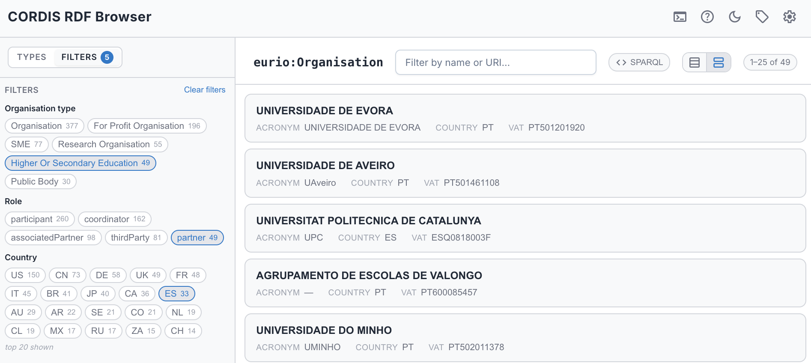
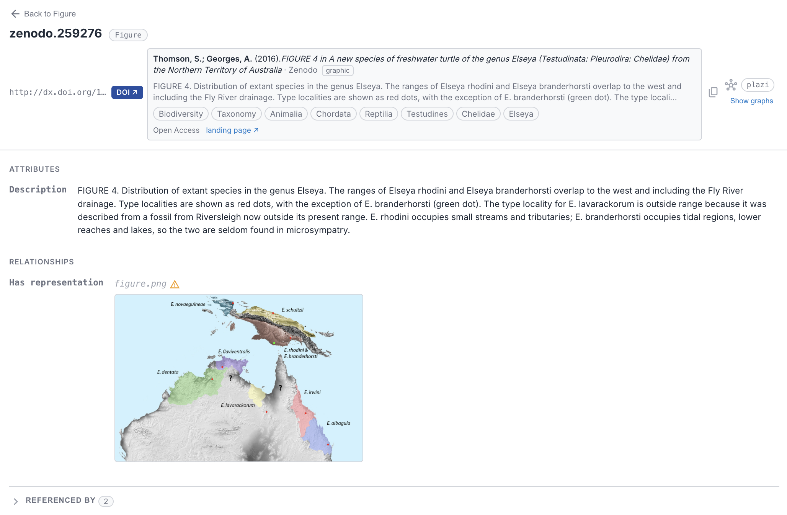
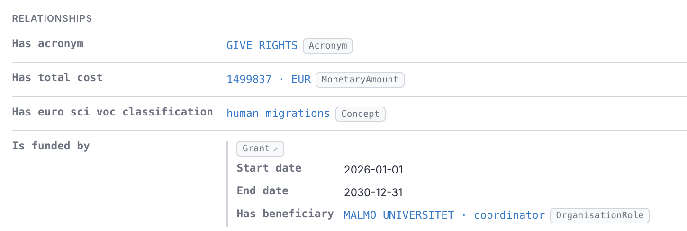
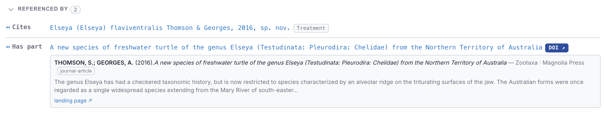
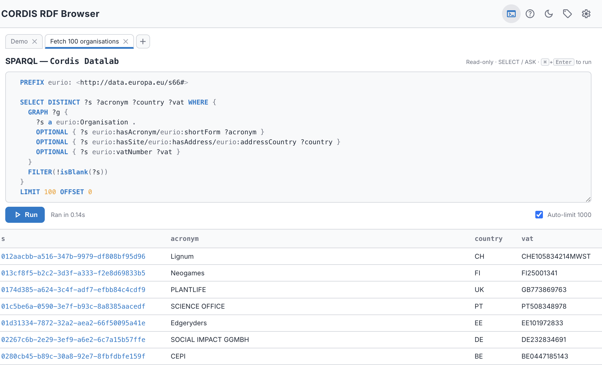

# AE RDF User Manual

A fast, browser-only explorer for **any** RDF dataset behind a SPARQL endpoint. Connect, see what types of things exist, drill into a type's instances, open any resource, and follow its links, all live, all in your browser. No backend, no precomputed indexes, no data leaves your machine.

> **Try it now**: [Open AE RDF](https://cognizone.github.io/augmented-semantics/rdf/) in your browser, no installation required.

*Above — a CORDIS organisation: the **Types** sidebar (left) for navigating the dataset, the resource's **attributes** and clickable **relationships**, and **nested value objects** inlined in place (site → postal address → coordinates), as deep as the data goes. [See this view live →](https://cognizone.github.io/augmented-semantics/rdf-cordis/?type=http%3A%2F%2Fdata.europa.eu%2Fs66%23Organisation&resource=http%3A%2F%2Fdata.europa.eu%2Fs66%2Fresource%2Forganisations%2F0174d385-a624-3c4f-adf7-efbb84c4cdf9)*

> **Live queries only** — AE RDF runs entirely on live SPARQL: no backend, no precomputed indexes, no data leaves your machine. Endpoint connection, type discovery, instance lists, the resource view with incoming links, and everything you see below all run as live queries against the endpoint.

## See it in action

<table>
<tr>
<td width="50%" valign="top">
<strong><a href="02-browsing.md">Browse by type</a></strong> 
The Types sidebar tree: subclasses and value objects nest under their parent, each with a live instance count. 
<a href="https://cognizone.github.io/augmented-semantics/rdf-cordis/">See it live →</a>
</td>
<td width="50%" valign="top">
<strong><a href="04-facets.md">Faceted browsing</a></strong> 
Narrow a type by its values, ranges, and dates (even values a hop away), with live counts. 
<a href="https://cognizone.github.io/augmented-semantics/rdf-cordis/?type=http%3A%2F%2Fdata.europa.eu%2Fs66%23Organisation&filters=%5B%5B0%2C%22v%22%2C%5B%5B%22u%22%2C%22http%3A%2F%2Fdata.europa.eu%2Fs66%23HigherOrSecondaryEducation%22%5D%5D%5D%2C%5B1%2C%22v%22%2C%5B%5B%22l%22%2C%22partner%22%2C%22%22%2C%22%22%5D%5D%5D%2C%5B2%2C%22v%22%2C%5B%5B%22l%22%2C%22ES%22%2C%22%22%2C%22%22%5D%5D%5D%5D">See it live →</a>
</td>
</tr>
<tr>
<td valign="top"></td>
<td valign="top"></td>
</tr>
<tr>
<td width="50%" valign="top">
<strong><a href="06-rich-values.md">Rich values</a></strong> 
Media inline, DOI citation cards, and WKT geometry as maps. 
<a href="https://cognizone.github.io/augmented-semantics/rdf/?endpoint=lindas-swiss-linked-data&resource=http%3A%2F%2Fdx.doi.org%2F10.5281%2Fzenodo.259276">See it live →</a>
</td>
<td width="50%" valign="top">
<strong><a href="03-resource-view.md#attributes-and-relationships">Deep embeds</a></strong> 
Value objects inlined with their own properties — a Grant's start date, end date, and beneficiary shown in place, nested as deep as the data goes. 
<a href="https://cognizone.github.io/augmented-semantics/rdf-cordis/?type=http%3A%2F%2Fdata.europa.eu%2Fs66%23Organisation&resource=http%3A%2F%2Fdata.europa.eu%2Fs66%2Fresource%2Forganisations%2F0174d385-a624-3c4f-adf7-efbb84c4cdf9">See it live →</a>
</td>
</tr>
<tr>
<td valign="top"></td>
<td valign="top"></td>
</tr>
<tr>
<td width="50%" valign="top">
<strong><a href="03-resource-view.md#referenced-by-incoming-links">Walk the graph backwards</a></strong> 
See what points <em>at</em> a resource — incoming links grouped by predicate, with blank-node restrictions inlined.
</td>
<td width="50%" valign="top">
<strong><a href="05-sparql.md">SPARQL panel</a></strong> 
A read-only SELECT / ASK console with named tabs, auto-<code>LIMIT</code>, paginated results, and portable prefixed queries.
</td>
</tr>
<tr>
<td valign="top"></td>
<td valign="top"></td>
</tr>
</table>

## Why it's different

Beyond running entirely on live queries, two things set AE RDF apart — and neither screenshots well:

- **[Graph provenance](07-graphs.md), always.** Every fact shows which named graph it lives in, right next to the resource. Most browsers flatten the graph and lose that.
- **[Cross-dataset auto-switch](08-sharing.md#auto-switch-across-datasets).** Paste or share any resource URI and AE RDF recognises which configured endpoint serves it, switches datasets, and opens it there — a link to a LINDAS resource just works even if you were on CORDIS.

It also gives you **table or card** instance views with server-side text filtering, fully **[shareable deep-link URLs](08-sharing.md)** (endpoint, type, resource, and filters — with working back/forward), **warning markers** on links whose target has no data in the endpoint, and typed-value polish: humanized predicates, thousands separators, and deprecation badges.

> **Want your endpoint on the list?** If you maintain a public SPARQL endpoint and would like it included as a suggested endpoint, [open an issue on GitHub](https://github.com/cognizone/augmented-semantics/issues).

## Getting Started

AE RDF connects directly to SPARQL endpoints from your browser — the endpoint must allow browser access ([CORS](10-troubleshooting.md#cors-the-endpoint-wont-load)).

### Quick Start

1. Open the endpoint menu in the header and pick an endpoint. (In the standalone / authoring build you can also **Add endpoint** for a custom URL, see [The Endpoint Manager](configuration.md#the-endpoint-manager).)
2. Once connected, the **Types** sidebar lists every `rdf:type` in the dataset with an instance count.
3. Click a type to see its instances, then click an instance to open it.
4. Or paste any **resource URI** into the bar at the top and press **Go**.

On a deployed instance the endpoints come from the app's bundled configuration; AE SKOS and AE RDF each ship their own, so the endpoint lists are **not** shared between the tools.

## User Guide

1. [Endpoints](01-endpoints.md) — Choosing and switching endpoints (adding your own is in the [Configuration Guide](configuration.md#the-endpoint-manager))
2. [Browsing](02-browsing.md) — Types and instance lists
3. [Resource view](03-resource-view.md) — Attributes, relationships, and incoming links
4. [Faceted browsing](04-facets.md) — Filter a type by its values, ranges, and dates
5. [SPARQL panel](05-sparql.md) — The read-only query console
6. [Rich values](06-rich-values.md) — Media, DOIs, and geometry maps
7. [Graphs](07-graphs.md) — How AE RDF shows which named graph each fact lives in
8. [Shareable URLs](08-sharing.md) — Deep-linking, bookmarking, and cross-dataset switching
9. [Settings](09-settings.md) — Display, sidebar, results, and authoring preferences
10. [Troubleshooting](10-troubleshooting.md) — CORS, empty results, slow queries

## Administration

- [Configuration Guide](configuration.md) — Authoring mode, per-type configuration, graph behaviour, and exporting a deployment config
- [Deployment & Releases](deployment.md) — GitHub Pages variants and the ERA standalone release process

---

*AE RDF is part of the [Augmented Semantics](https://github.com/cognizone/augmented-semantics) toolkit by [Cognizone](https://cogni.zone).*
