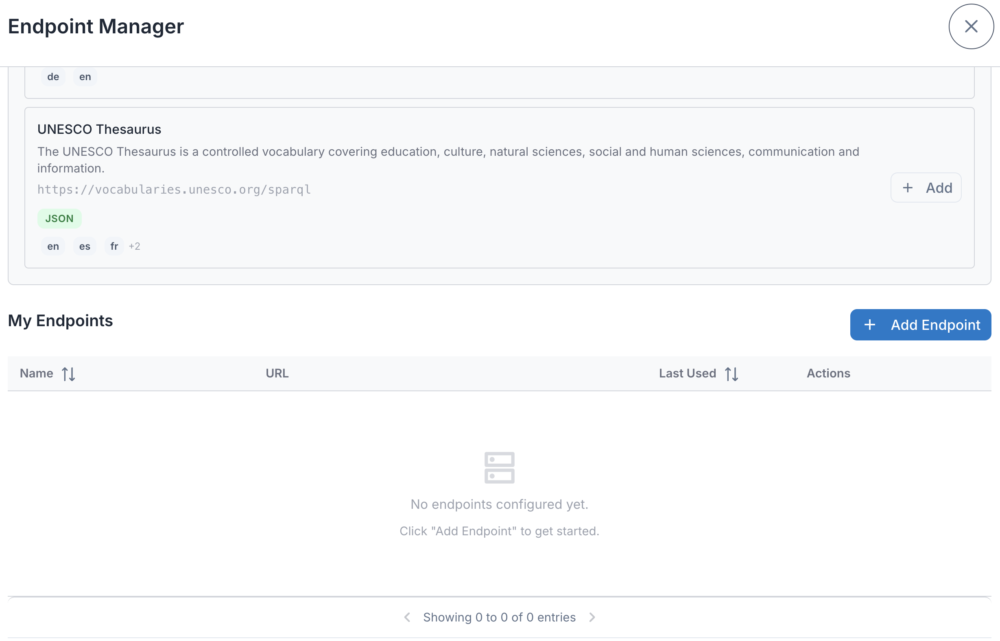
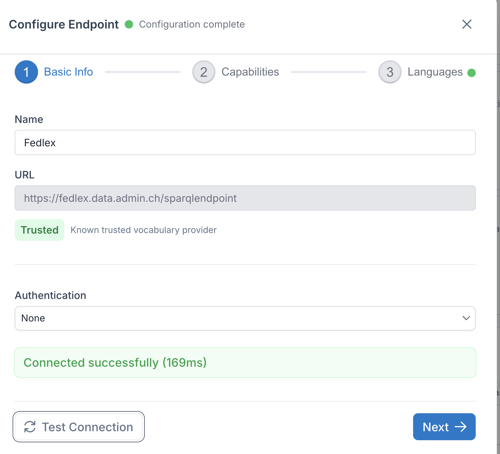
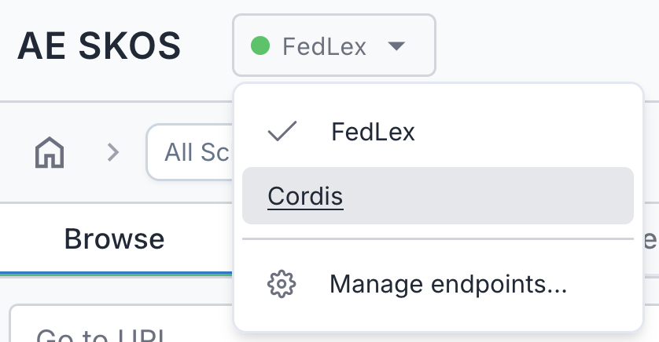

[← Back to User Manual](index.md)

# 1. Managing Endpoints

- [Opening the Endpoint Manager](#opening-the-endpoint-manager)
- [Suggested Endpoints](#suggested-endpoints)
- [Adding a New Endpoint](#adding-a-new-endpoint)
- [Managing Your Endpoints](#managing-your-endpoints)
- [Endpoint Status Indicators](#endpoint-status-indicators)
  - [Connection Status](#connection-status)
  - [Status Tags](#status-tags)
- [Activating an Endpoint](#activating-an-endpoint)
- [Editing an Endpoint](#editing-an-endpoint)
- [Deleting an Endpoint](#deleting-an-endpoint)
- [Switching Endpoints](#switching-endpoints)

> **Note:** AE SKOS is primarily designed for use with public SPARQL endpoints. While authentication options (Basic Auth, API Key, Bearer Token) are available, they are experimental and not extensively tested. For sensitive data, consult your organization's security policies.

## Opening the Endpoint Manager

Click the endpoint badge in the header toolbar, then select "Manage endpoints..." from the dropdown.

## Suggested Endpoints

The Endpoint Manager shows a curated list of public SKOS endpoints at the top:

- Click **Add** next to any endpoint to add it to your list
- Click **Import All** to add all suggested endpoints at once
- Suggested endpoints are pre-analyzed with detected languages and capabilities

> **Want your endpoint on the list?** If you maintain a public SKOS endpoint and would like it included as a suggested endpoint (pre-analyzed, no setup needed for users), [open an issue on GitHub](https://github.com/cognizone/augmented-semantics/issues).

Once added, endpoints appear in your "My Endpoints" list below.

## Adding a New Endpoint

1. Click **Add Endpoint** in the Endpoint Manager

2. The setup wizard opens with multiple steps:

### Step 1: Connection

- **Name**: A friendly name for this endpoint (e.g., "Fedlex")
- **URL**: The SPARQL endpoint URL (e.g., `https://fedlex.data.admin.ch/sparqlendpoint`)
- **Authentication**: Optional - supports Basic Auth, API Key, or Bearer Token

Click **Test Connection** to verify the endpoint is reachable.

### Step 2: Analysis

The wizard automatically analyzes the endpoint and shows six capabilities:

| Capability | Description |
|------------|-------------|
| SKOS Content | Whether the endpoint contains SKOS concepts or schemes |
| Concept Count | Total number of SKOS concepts |
| Concept Schemes | Number of concept schemes found |
| Relationships | Available relationship types (inScheme, topConceptOf, broader, narrower, etc.) |
| Graph Support | Whether the endpoint supports named graph queries |
| SKOS Graphs | How many graphs contain SKOS data |

Languages are also detected during this step and shown in the next step (Language Priorities).

### Step 3: Language Priorities

Drag and drop languages to set your preferred order. Labels will be shown in the first available language from this list.

Endpoint configuration is automatically saved to your browser's localStorage. Your endpoints persist across sessions — no export or manual save needed.

## Managing Your Endpoints

Once you've added endpoints, they appear in the Endpoint Manager list.

Each endpoint shows:
- **Name**: The friendly name you assigned
- **URL**: The SPARQL endpoint address
- **Active badge**: Indicates the currently selected endpoint

## Endpoint Status Indicators

### Connection Status

Each endpoint displays a colored dot next to its name indicating overall configuration health. Hover over the dot to see the specific reason. The dot also appears in the endpoint wizard header:

| Color | Meaning |
|-------|---------|
| Green | Fully configured — connection tested, SKOS content found, languages detected. |
| Orange | Partially configured or in progress — analysis hasn't run yet, connection test in progress, CORS issue detected, or no languages detected. |
| Red | Problem detected — invalid URL, connection failed, or no SKOS content found. |
| Gray | Not yet configured — no URL entered. |

### Status Tags

Endpoints in your list may also display status tags that indicate detected capabilities or issues:

| Tag | Meaning |
|-----|---------|
| **JSON** / **XML** | The response format returned by the endpoint. JSON is preferred for performance; XML works but is used as a fallback. This is auto-detected during analysis. |
| **CORS Issue** | The endpoint blocks browser-based access due to missing CORS headers. Since AE SKOS runs entirely in the browser, it cannot reach endpoints that don't allow cross-origin requests. As a workaround, you can install a CORS browser extension (search for "CORS Unblock" in your browser's extension store). |
| **Scheme URI mismatch** | A trailing-slash inconsistency was detected between how concept scheme URIs are declared and how they are referenced by concepts. This can cause the tree to appear empty even though concepts exist. To fix this, enable **Enable Scheme URI Slash Fix** in [Settings → Developer](05-settings.md#developer-section). |

## Activating an Endpoint

To switch to a different endpoint, click the link icon () next to the endpoint you want to use. The clicked endpoint becomes active (indicated by the green **ACTIVE** badge, as shown in the [screenshot above](#status-tags)) and is used for all browsing and search operations. Your tree view and details panel will update to show data from the newly activated endpoint.

## Editing an Endpoint

Click the configure button () next to any endpoint to reopen the wizard with existing settings.

**Tip:** You can also click anywhere on an endpoint row to open the configuration wizard.

## Deleting an Endpoint

Click the delete button (🗑️) next to an endpoint. A confirmation dialog will appear before deletion.

## Switching Endpoints

Click the endpoint badge in the header and select a different endpoint from the dropdown.

> **Tip:** If you have many endpoints, the dropdown is scrollable.

---

← <a href="index.md">User Manual</a> &nbsp; · &nbsp; <a href="02-browsing.md">2. Browsing</a> →

