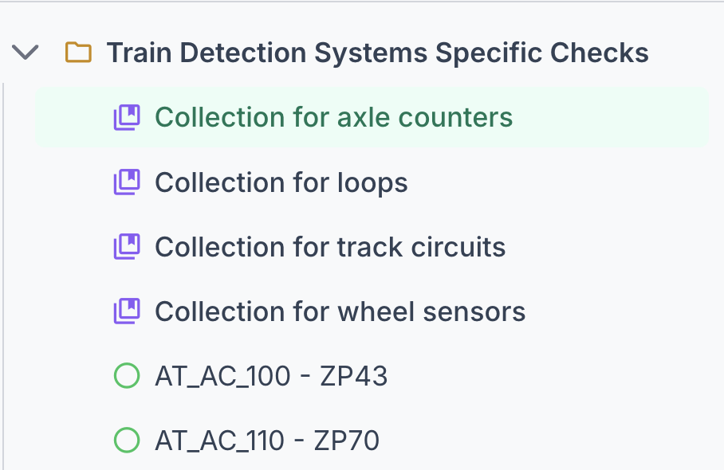

[← Back to User Manual](index.md)

# 2. Browsing

- [Switching Browsing Modes](#switching-browsing-modes)
- [Browsing Concept Schemes](#browsing-concept-schemes)
- [Browsing Collections](#browsing-collections)
- [Browsing Ordered Collections](#browsing-ordered-collections)

## Switching Browsing Modes

Use the breadcrumb dropdown to switch between three browsing modes:

1. Click the first breadcrumb segment (shows "Schemes", "Collections", or "Ordered Collections")
2. Select your preferred browsing mode from the dropdown

| Mode | Description |
|------|-------------|
| [Schemes](#browsing-concept-schemes) | Browse concepts organized by concept schemes (default) |
| [Collections](#browsing-collections) | Browse concepts organized by SKOS collections |
| [Ordered Collections](#browsing-ordered-collections) | Browse ordered collections where members are displayed in a defined sequence |

---

## Browsing Concept Schemes

### Selecting a Scheme

Use the scheme dropdown in the breadcrumb bar to select a concept scheme.

**Filtering Schemes:** For endpoints with many schemes, use the filter input at the top of the dropdown. Type to filter schemes by name - the list updates as you type. The filter automatically clears after you make a selection.

The dropdown also includes an **Orphan Concepts & Collections** entry for finding disconnected concepts. If you don't see it, enable it in [Settings](05-settings.md) under "Show Orphan Concepts in Scheme Selector".

When you select a scheme:
- The tree loads with top-level concepts
- The right panel shows scheme details
- The scheme is added to your recent history

### Scheme Details

When viewing a scheme (no concept selected), the right panel displays scheme information including titles, labels, documentation, and metadata. See [Scheme Details](03-details.md#scheme-details) for the full list of sections.

### Collections Within a Scheme

Some schemes contain SKOS collections that group related concepts together. When browsing such a scheme, collections appear in the tree alongside regular concepts:

### Orphan Concepts

Orphan concepts are concepts that lack proper hierarchical relationships within their scheme. Specifically, a concept is considered an orphan if it:
- Has no `skos:broader` relationship to a parent concept
- Has no `skos:topConceptOf` relationship to a scheme
- Is not referenced as a `skos:narrower` of another concept

These concepts exist in the vocabulary but are disconnected from the main hierarchy, making them difficult to discover through normal browsing.

**Finding Orphan Concepts:**

1. Open the scheme dropdown in the breadcrumb bar
2. Look for "Orphan Concepts & Collections" at the top of the list
3. Select it to load orphan concepts in the tree

The first time you access orphan concepts for an endpoint, the application runs a detection process in the background. Results are cached for subsequent access. Note that orphan detection can be quite slow on large endpoints and is not recommended for endpoints with millions of concepts.

Once complete, the tree shows both orphan concepts and orphan collections:

> **Not seeing the orphan selector?** It must be enabled in [Settings](05-settings.md) under "Show Orphan Concepts in Scheme Selector".

### Navigating the Concept Tree

#### Tree Structure

The concept tree displays a hierarchical view of concepts within the selected scheme.

Concepts with children show an arrow (▶) that can be expanded to reveal child concepts. Leaf concepts (no children) are shown as circles without an arrow. Children are loaded on-demand as you expand nodes.

**Node types:**
- **Folder icon** (orange) — Scheme root node
- **Label icon** (purple, with arrow) — Concept with children, click arrow to expand
- **Circle** (green) — Leaf concept, no children
- **Tree icon** at the end of a label — indicates the concept is a top concept inferred from `skos:inScheme` only (no explicit `skos:topConceptOf`)
- **Collection icon** (purple) — SKOS collection, may appear alongside concepts within a scheme

#### Selecting a Concept

Click on any concept label to:
- Select it (highlighted in the tree)
- Load its details in the right panel
- Update the breadcrumb path

#### Go to URI

Use the "Go to URI..." input at the top of the tree to navigate directly to any concept or scheme by its URI.

<!-- IMAGE: screenshots/goto-uri.png -->

**Supported URIs:**
- **Concept URI**: Selects the concept and reveals it in the tree
- **Scheme URI**: Switches to that scheme and shows its details

**Tip:** You can paste URIs with angle brackets (e.g., `<http://example.org/concept/1>`) - they're automatically cleaned.

#### Breadcrumb Navigation

The breadcrumb bar combines a root mode dropdown, a scheme selector, and a concept path. When you navigate into a hierarchy, ancestor concepts appear as clickable segments — click any segment to jump back to that level.

#### Deprecation Indicators

Deprecated concepts are visually indicated with:
- A "deprecated" badge after the label
- Reduced opacity (60%)

---

## Browsing Collections

SKOS Collections provide an alternative way to organize concepts, independent of the hierarchical broader/narrower relationships.

When in Collections mode:
- The tree shows top-level collections
- Expand a collection to see its members (concepts or nested collections)
- Click a collection to view its details in the right panel
- Ordered collections display members in their defined sequence

### Collection Details

When you select a collection, the right panel shows its details including labels, members, and metadata. See [Collection Details](03-details.md#collection-details) for the full list of sections.

---

## Browsing Ordered Collections

Ordered Collections are a special type of SKOS collection where members are displayed in a defined sequence (using `skos:memberList` with RDF lists).

### Switching to Ordered Collections Mode

1. Click the browsing mode dropdown in the breadcrumb bar
2. Select "Ordered Collections"

### Viewing Ordered Collections

When in Ordered Collections mode:
- The tree shows all ordered collections in the endpoint (flat list, no nesting)
- Members are displayed in their defined sequence order
- Click a collection to view its details in the right panel

**Note:** Not all endpoints have ordered collections. If the list is empty, the endpoint doesn't use this SKOS feature. Endpoints with ordered collections include EU Publications Office and Getty Vocabularies.

### Ordered Collection Details

When you select an ordered collection, the right panel shows similar sections as regular collections, with members displayed in their defined sequence. See [Ordered Collection Details](03-details.md#ordered-collection-details) for more information.

---

← <a href="01-endpoints.md">1. Managing Endpoints</a> &nbsp; · &nbsp; <a href="index.md">User Manual</a> &nbsp; · &nbsp; <a href="03-details.md">3. Viewing Details</a> →

