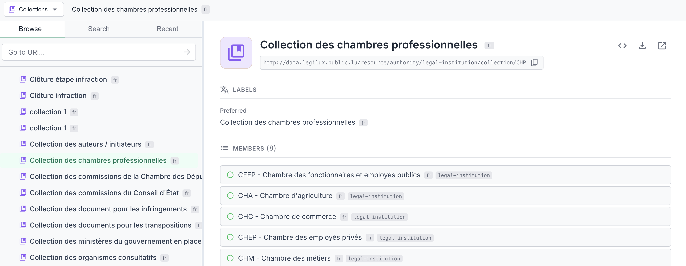
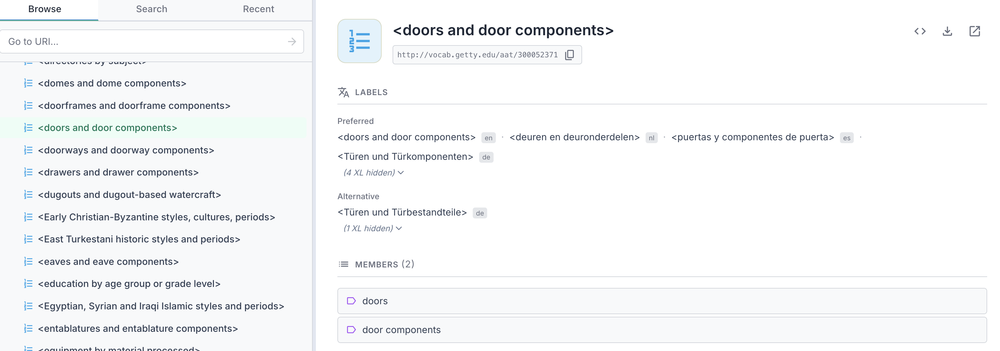

[← Back to User Manual](index.md)

# 3. Viewing Details

When you select an item in the tree, the right panel displays its details. The content varies by item type. Sections are only displayed when the resource has data for that section.

- [Header Actions](#header-actions)
- [Scheme Details](#scheme-details)
- [Concept Details](#concept-details)
- [Collection Details](#collection-details)
- [Ordered Collection Details](#ordered-collection-details)

---

## Header Actions

The details header includes action buttons that are available for all item types:

| Icon | Action |
|------|--------|
|  | Copy URI to clipboard |
|  | View raw RDF data |
|  | Download RDF data |
|  | Open URI in new tab |

---

## Scheme Details

When viewing a scheme (no concept selected), the right panel displays information about the concept scheme itself.

The following sections appear:

- **Titles** — Dublin Core titles (dct:title, dc:title) and RDFS labels
- **Labels & Notation** — Preferred, alternative, and hidden labels, plus notation codes
- **Documentation** — Definitions, descriptions, scope notes, history/change/editorial notes, examples
- **Metadata** — Creator, publisher, rights, license, identifier, status, version, dates (issued, created, modified), deprecation status
- **Other Properties** — Any additional RDF properties not covered above

Schemes marked as deprecated show a "deprecated" badge next to their name in both the dropdown and the tree.

---

## Concept Details

When a concept is selected, the right panel shows comprehensive information:

The details panel shows the following sections:

- **Labels & Notation** — Preferred, alternative, and hidden labels, plus notation codes. Language tags are shown when a label's language differs from your preferred language.
- **Titles** — Dublin Core titles (dct:title, dc:title) and RDFS labels, if present
- **Documentation** — Definition, description, comment, scope note, history/change/editorial notes, examples
- **Hierarchy** — Broader (parent) and narrower (child) concepts, clickable to navigate
- **Relations** — Related concepts (skos:related), clickable to navigate
- **Mappings** — Links to equivalent concepts in other vocabularies: exact match, close match, broad match, narrow match, related match
- **Collections** — Which collections this concept belongs to
- **Schemes** — Which concept schemes this concept is in
- **Metadata** — Creator, publisher, rights, license, identifier, status, version, dates (issued, created, modified), deprecation
- **Other Properties** — Any additional RDF properties not covered above

---

## Collection Details

When you select a collection, the right panel shows its details.

The following sections appear:

- **Labels & Notation** — Preferred, alternative, and hidden labels, plus notation codes
- **Members** — List of member concepts and sub-collections, with a count badge. Members are loaded progressively (labels, hierarchy icons, scheme badges). Click any member to navigate to it.
- **Titles** — Dublin Core titles (dct:title, dc:title) and RDFS labels
- **Schemes** — Which concept schemes this collection belongs to
- **Documentation** — Definition, description, scope notes, history/change/editorial notes, examples
- **Metadata** — Creator, publisher, rights, license, identifier, status, version, dates, deprecation
- **Other Properties** — Any additional RDF properties

---

## Ordered Collection Details

Ordered collections (`skos:OrderedCollection`) are a special type of collection where members are stored in a defined sequence using `skos:memberList` with RDF lists.

When you select an ordered collection, the right panel shows the same sections as regular collections, but the **Members** list preserves the defined order:

- **Labels & Notation** — Preferred, alternative, and hidden labels, plus notation codes
- **Members** — List of member concepts and sub-collections, displayed in their defined sequence order. Click any member to navigate to it.
- **Titles** — Dublin Core titles (dct:title, dc:title) and RDFS labels
- **Schemes** — Which concept schemes this collection belongs to
- **Documentation** — Definition, description, scope notes, history/change/editorial notes, examples
- **Metadata** — Creator, publisher, rights, license, identifier, status, version, dates, deprecation
- **Other Properties** — Any additional RDF properties

This is useful for vocabularies that require members to appear in a specific sequence, such as classification codes or enumerated lists.

---

← <a href="02-browsing.md">2. Browsing</a> &nbsp; · &nbsp; <a href="index.md">User Manual</a> &nbsp; · &nbsp; <a href="04-search.md">4. Search & History</a> →

