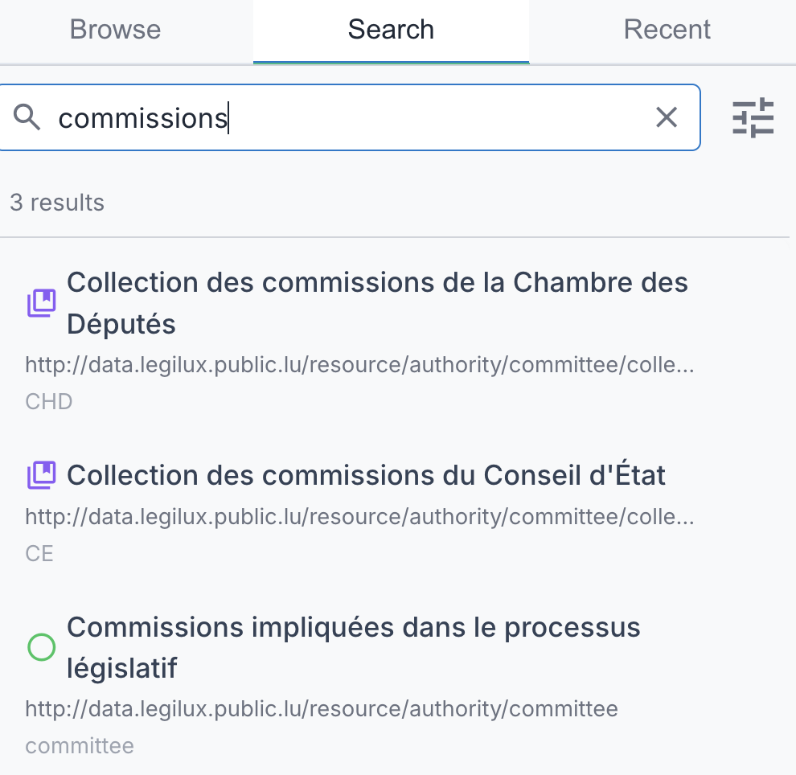
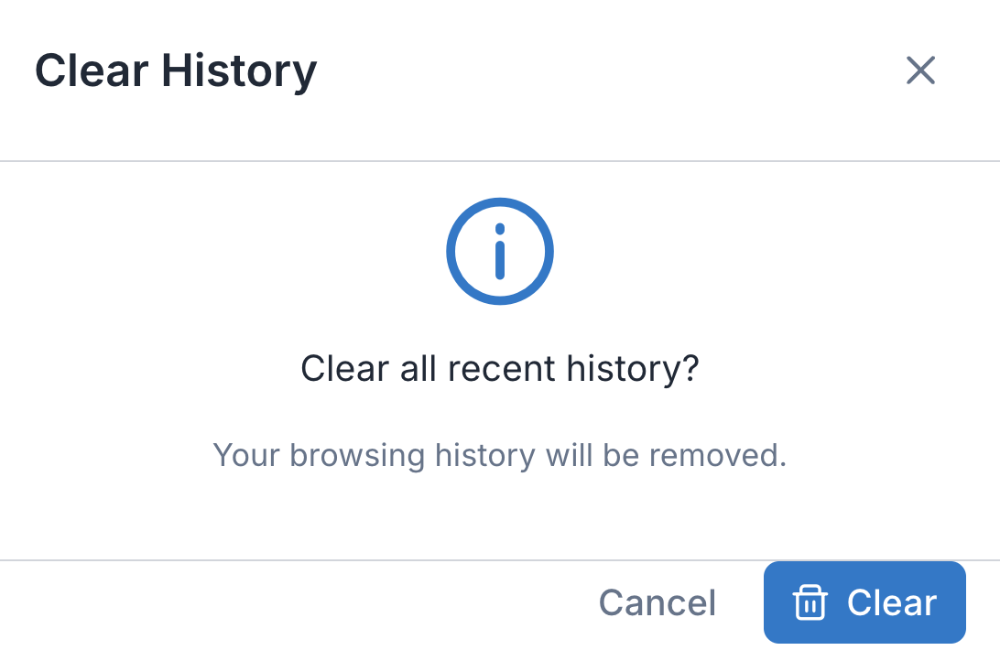

[← Back to User Manual](index.md)

# 4. Search & History

- [Searching](#searching)
- [Recent History](#recent-history)

## Searching

### Search Interface

Click the **Search** tab in the left sidebar to access the search panel.

### Basic Search

1. Enter your search term — results appear as you type
2. Refine your query to narrow results

Results show:
- Concept label and notation
- Which field matched (prefLabel, altLabel, definition, notation)
- The scheme containing the concept

### Search Settings

Click the settings icon () next to the search input to configure match mode, search targets, and scope. See [5. Settings — Search Section](05-settings.md#search-section) for details.

Settings are saved automatically and persist across sessions. When you change settings, any active search re-runs automatically.

### Navigating Results

Click any search result to:
- Switch to the browse tab and select that concept in the tree
- Expand ancestors as needed and scroll the concept into view
- Show its details in the right panel
- Switch scheme automatically if the concept belongs to a different scheme
- Add the concept to your [Recent History](#recent-history)

---

## Recent History

### Viewing History

Click the **Recent** tab in the left sidebar to see your browsing history.

Each entry shows:
- Icon indicating type (folder for schemes, label/circle for concepts)
- Label and notation
- Context (endpoint name, scheme name)
- Relative timestamp (e.g., "5 min ago")

### Navigating from History

Click any history entry to:
- Switch to the browse tab and navigate to that item
- Switch endpoints or schemes if necessary
- Expand ancestors and scroll the concept into view
- Show its details in the right panel

### Clearing History

Click the delete button (🗑️) in the history header. A confirmation dialog appears before clearing.

### History Persistence

History is saved to your browser's localStorage and persists across sessions. Up to 50 items are stored.

---

← [3. Viewing Details](03-details.md) &nbsp; · &nbsp; [User Manual](index.md) &nbsp; · &nbsp; [5. Settings](05-settings.md) →
