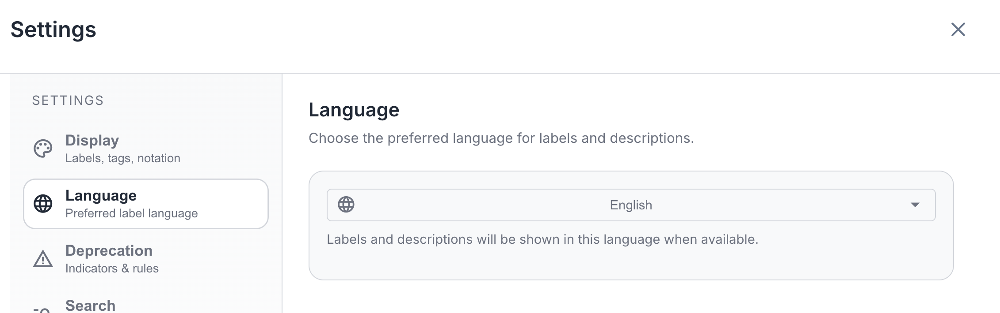
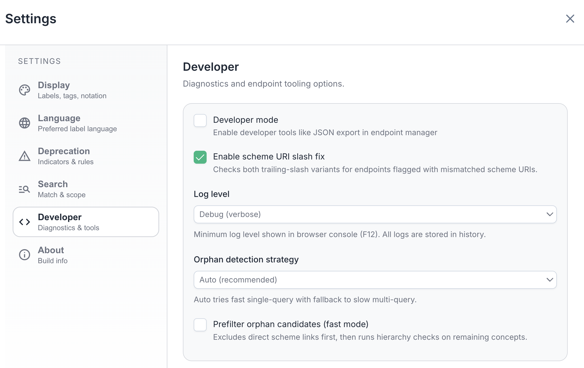
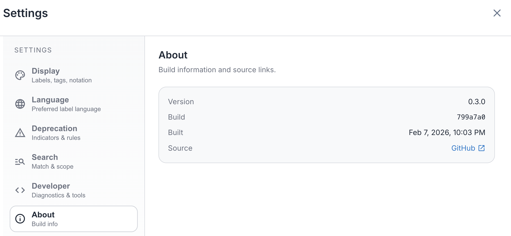

[← Back to User Manual](index.md)

# 5. Settings

- [Opening Settings](#opening-settings)
- [Display](#display-section)
- [Language](#language-section)
- [Deprecation](#deprecation-section)
- [Search](#search-section)
- [Developer](#developer-section)
- [About](#about-section)
- [Pre-configured Deployments](#pre-configured-deployments)
- [Reset to Defaults](#reset-to-defaults)

## Opening Settings

Click the settings button () in the [header toolbar](index.md#header-toolbar). The Settings dialog uses a sidebar navigation with six sections.

## Display Section

Control how labels and metadata are formatted in the details panel.

| Setting | Description |
|---------|-------------|
| Show Datatypes | Display datatype tags (e.g., `xsd:date`, `xsd:boolean`) next to property values in the details panel. |
| Show xsd:string | When Show Datatypes is enabled, also display the `xsd:string` tag on plain text values. Off by default since most values are strings. |
| Show Language Tags | Show language codes (e.g., `en`, `fr`) on labels when the language differs from your preferred language. |
| Include Preferred Language | Also show the language tag on labels that match your preferred language. Only applies when Show Language Tags is enabled. |
| Show Notation in Labels | Prefix concept labels with their notation code (e.g., "01 - Agriculture" instead of "Agriculture"). Also affects sorting. |
| Show Orphans Selector | Add an "Orphan Concepts & Collections" entry to the scheme dropdown for finding disconnected concepts. See [Orphan Concepts](02-browsing.md#orphan-concepts). |

## Language Section

Select your preferred language for viewing labels. Only languages detected in the current endpoint are shown. The dropdown shows all available languages with their full names.

> **Tip:** You can also quickly switch languages from the [header toolbar](index.md#header-toolbar) without opening Settings.

## Deprecation Section

| Setting | Description |
|---------|-------------|
| Show Deprecation Indicators | Toggle visibility of deprecated badges. See [how deprecation appears in the tree](02-browsing.md#deprecation-indicators). |

**Detection Rules:**
Configure which conditions indicate deprecation:
- OWL Deprecated: `owl:deprecated = true`
- EU Vocabularies Status: Status not equal to CURRENT

## Search Section

Configure search behavior (also accessible via the [settings button in the Search panel](04-search.md#search-settings)):

| Setting | Description |
|---------|-------------|
| Match Mode | How search terms are matched: **Contains** (substring match anywhere), **Starts with** (prefix match), **Exact** (full label must match), or **Regex** (regular expression pattern using SPARQL regex). |
| Search in Preferred Labels | Include `skos:prefLabel` values when searching. Enabled by default. |
| Search in Alternative Labels | Include `skos:altLabel` values when searching. Enabled by default. |
| Search in Definitions | Also search inside `skos:definition` text. Off by default since it can slow down queries on large endpoints. |
| Search All Schemes | Search across all concept schemes in the endpoint, ignoring the currently selected scheme filter. Enabled by default. |

## Developer Section

| Setting | Description |
|---------|-------------|
| Developer Mode | Enable developer tools like JSON export in the Endpoint Manager. |
| Enable Scheme URI Slash Fix | Checks both trailing-slash variants for endpoints flagged with mismatched scheme URIs. Turn this on if the [Scheme URI mismatch](01-endpoints.md#endpoint-status-indicators) tag appears on an endpoint. |
| Log Level | Minimum log level shown in the browser console (F12). Higher levels mean fewer messages. |
| Orphan Detection Strategy | **Auto** (recommended) tries a fast single-query approach first, with fallback to a slower multi-query method. |
| Prefilter Orphan Candidates | Excludes direct scheme links first, then runs hierarchy checks on the remaining concepts. Can speed up orphan detection on large endpoints. |

When Developer Mode is enabled:
- A download button appears next to each endpoint in the Endpoint Manager
- Click the download button to export endpoint data as JSON
- The export includes: endpoint name, URL, analysis data, and language priorities

**Log history:** All log entries are kept in memory (last 100) regardless of the Log Level setting. In development builds, you can access them from the browser console by typing `__logger.dump()` to print all recent logs, or `__logger.getHistory()` to get them as an array.

## About Section

View build information including version number, build commit, build date, and a link to the [source code on GitHub](https://github.com/cognizone/augmented-semantics).

## Pre-configured Deployments

Some deployments of AE SKOS may be pre-configured by administrators:
- A custom logo may appear in the header for branded deployments
- Endpoint management features may be restricted
- Some settings (like Developer Mode) may be hidden

If you're using a pre-configured deployment and need to modify settings, contact your administrator. Administrators can find setup instructions in the [Deployment Guide](https://github.com/cognizone/augmented-semantics/blob/main/ae-skos/DEPLOYMENT.md).

## Reset to Defaults

Click "Reset to defaults" to restore all settings to their original values.

---

← [4. Search & History](04-search.md) &nbsp; · &nbsp; [User Manual](index.md) &nbsp; · &nbsp; [6. Troubleshooting](06-troubleshooting.md) →
