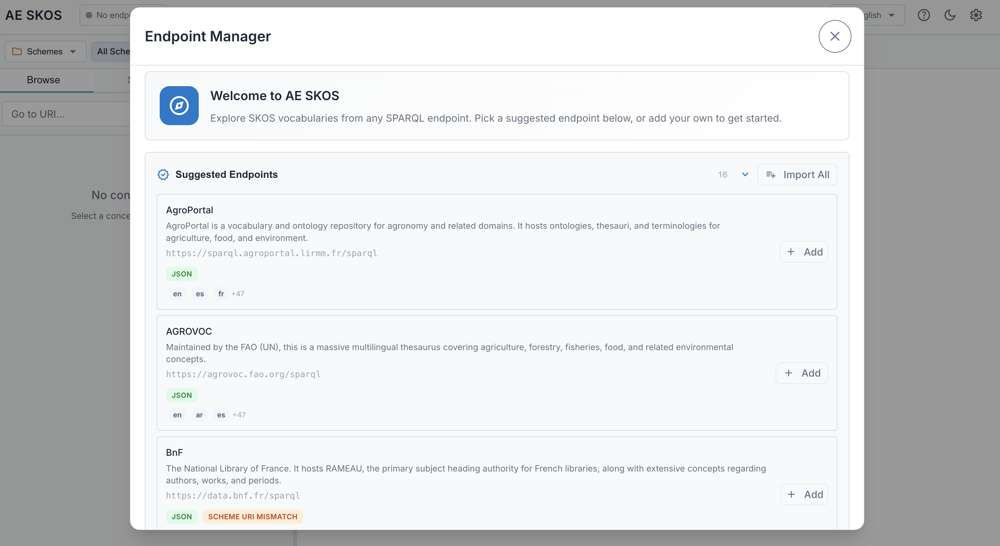
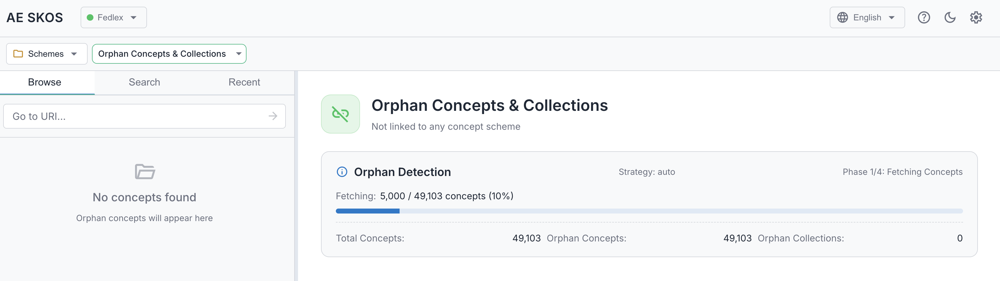

# AE SKOS User Manual

A fast, modern browser for exploring SKOS vocabularies. Lazy-loaded trees, instant search, multilingual support, dark mode, and keyboard shortcuts — all running directly in your browser. No backend, no installation, no data leaves your machine.

## Table of Contents

- [Getting Started](#getting-started)
- [Managing Endpoints](#managing-endpoints)
- [Switching Browsing Modes](#switching-browsing-modes)
- [Browsing Concept Schemes](#browsing-concept-schemes)
- [Navigating the Concept Tree](#navigating-the-concept-tree)
- [Browsing Collections](#browsing-collections)
- [Viewing Details](#viewing-details)
- [Searching](#searching)
- [Recent History](#recent-history)
- [Settings](#settings)
- [Keyboard Shortcuts](#keyboard-shortcuts)
- [Troubleshooting](#troubleshooting)

---

## Getting Started

AE SKOS connects directly to SPARQL endpoints in your browser - no backend server required. Your data stays between you and the endpoint.

### First Launch

When you first open AE SKOS, what you see depends on how it was deployed:

| Standard Mode | Pre-configured Mode |
|---------------|---------------------|
| The Endpoint Manager opens with suggested endpoints for you to add and manage. | Endpoints are already set up by an administrator — you're ready to browse. |
|  |  |
| Continue with **Quick Start** below | Skip to [Browsing Concept Schemes](#browsing-concept-schemes) |

### Quick Start

1. Pick a **suggested endpoint** from the list, or click "Add Endpoint" for a custom URL
2. Click **Done** to close the Endpoint Manager
3. Select a concept scheme from the dropdown
4. Start browsing!

---

## Managing Endpoints

> **Note:** AE SKOS is primarily designed for use with public SPARQL endpoints. While authentication options (Basic Auth, API Key, Bearer Token) are available, they are experimental and not extensively tested. For sensitive data, consult your organization's security policies.

### Opening the Endpoint Manager

Click the endpoint badge in the header toolbar, then select "Manage endpoints..." from the dropdown.

### Suggested Endpoints

The Endpoint Manager shows a curated list of public SKOS endpoints at the top:

- Click **Add** next to any endpoint to add it to your list
- Click **Import All** to add all suggested endpoints at once
- Suggested endpoints are pre-analyzed with detected languages and capabilities

Once added, endpoints appear in your "My Endpoints" list below.

### Adding a New Endpoint

1. Click **Add Endpoint** in the Endpoint Manager

2. The setup wizard opens with multiple steps:

#### Step 1: Connection

- **Name**: A friendly name for this endpoint (e.g., "Fedlex")
- **URL**: The SPARQL endpoint URL (e.g., `https://fedlex.data.admin.ch/sparqlendpoint`)
- **Authentication**: Optional - supports Basic Auth, API Key, or Bearer Token

Click **Test Connection** to verify the endpoint is reachable.

#### Step 2: Analysis

The wizard automatically analyzes the endpoint and shows six capabilities:

| Capability | Description |
|------------|-------------|
| SKOS Content | Whether the endpoint contains SKOS concepts or schemes |
| Concept Count | Total number of SKOS concepts |
| Concept Schemes | Number of concept schemes found |
| Relationships | Available relationship types (inScheme, topConceptOf, broader, narrower, etc.) |
| Graph Support | Whether the endpoint supports named graph queries |
| SKOS Graphs | How many graphs contain SKOS data |

Languages are also detected during this step and shown in the next step (Language Priorities).

#### Step 3: Language Priorities

Drag and drop languages to set your preferred order. Labels will be shown in the first available language from this list.

### Managing Your Endpoints

Once you've added endpoints, they appear in the Endpoint Manager list.

Each endpoint shows:
- **Name**: The friendly name you assigned
- **URL**: The SPARQL endpoint address
- **Active badge**: Indicates the currently selected endpoint

### Activating an Endpoint

To switch to a different endpoint, click the link icon () next to the endpoint you want to use. The clicked endpoint becomes active (indicated by the "active" badge) and is used for all browsing and search operations. Your tree view and details panel will update to show data from the newly activated endpoint.

### Editing an Endpoint

Click the configure button () next to any endpoint to reopen the wizard with existing settings.

**Tip:** You can also click anywhere on an endpoint row to open the configuration wizard.

### Deleting an Endpoint

Click the delete button (🗑️) next to an endpoint. A confirmation dialog will appear before deletion.

### Switching Endpoints

Click the endpoint badge in the header and select a different endpoint from the dropdown.

---

## Switching Browsing Modes

Use the breadcrumb dropdown to switch between three browsing modes:

1. Click the first breadcrumb segment (shows "Schemes", "Collections", or "Ordered Collections")
2. Select your preferred browsing mode from the dropdown

| Mode | Description |
|------|-------------|
| [Schemes](#browsing-concept-schemes) | Browse concepts organized by concept schemes (default) |
| [Collections](#browsing-collections) | Browse concepts organized by SKOS collections |
| [Ordered Collections](#browsing-ordered-collections) | Browse ordered collections where members are displayed in a defined sequence |

---

## Browsing Concept Schemes

### Selecting a Scheme

Use the scheme dropdown in the breadcrumb bar to select a concept scheme.

**Filtering Schemes:** For endpoints with many schemes, use the filter input at the top of the dropdown. Type to filter schemes by name - the list updates as you type. The filter automatically clears after you make a selection.

The dropdown also includes an **Orphan Concepts & Collections** entry for finding disconnected concepts. If you don't see it, enable it in [Settings](#settings) under "Show Orphan Concepts in Scheme Selector".

When you select a scheme:
- The tree loads with top-level concepts
- The right panel shows scheme details
- The scheme is added to your recent history

### Scheme Details

When viewing a scheme (no concept selected), the right panel displays:

- **Titles**: Dublin Core titles (dct:title, dc:title) and RDFS labels
- **Labels & Notation**: Preferred, alternative, and hidden labels, plus notation codes
- **Documentation**: Definitions, descriptions, scope notes, history/change/editorial notes, examples
- **Metadata**: Creator, publisher, rights, license, identifier, status, version, dates (issued, created, modified), deprecation status
- **Other Properties**: Any additional RDF properties not covered above

Schemes marked as deprecated show a "deprecated" badge next to their name in both the dropdown and the tree.

### Collections Within a Scheme

Some schemes contain SKOS collections that group related concepts together. When browsing such a scheme, collections appear in the tree alongside regular concepts:

### Orphan Concepts

Orphan concepts are concepts that lack proper hierarchical relationships within their scheme. Specifically, a concept is considered an orphan if it:
- Has no `skos:broader` relationship to a parent concept
- Has no `skos:topConceptOf` relationship to a scheme
- Is not referenced as a `skos:narrower` of another concept

These concepts exist in the vocabulary but are disconnected from the main hierarchy, making them difficult to discover through normal browsing.

**Finding Orphan Concepts:**

1. Open the scheme dropdown in the breadcrumb bar
2. Look for "Orphan Concepts & Collections" at the top of the list
3. Select it to load orphan concepts in the tree

The first time you access orphan concepts for an endpoint, the application runs a detection process in the background. Results are cached for subsequent access. Note that orphan detection can be quite slow on large endpoints and is not recommended for endpoints with millions of concepts.

Once complete, the tree shows both orphan concepts and orphan collections:

> **Not seeing the orphan selector?** It must be enabled in [Settings](#settings) under "Show Orphan Concepts in Scheme Selector".

---

## Navigating the Concept Tree

### Tree Structure

The concept tree displays a hierarchical view of concepts within the selected scheme.

Concepts with children show an arrow (▶) that can be expanded to reveal child concepts. Leaf concepts (no children) are shown as circles without an arrow. Children are loaded on-demand as you expand nodes.

**Node types:**
- **Folder icon** (orange) — Scheme root node
- **Label icon** (purple, with arrow) — Concept with children, click arrow to expand
- **Circle** (green) — Leaf concept, no children
- **Tree icon** at the end of a label — indicates the concept is a top concept inferred from `skos:inScheme` only (no explicit `skos:topConceptOf`)
- **Collection icon** (purple) — SKOS collection, may appear alongside concepts within a scheme

### Selecting a Concept

Click on any concept label to:
- Select it (highlighted in the tree)
- Load its details in the right panel
- Update the breadcrumb path

### Go to URI

Use the "Go to URI..." input at the top of the tree to navigate directly to any concept or scheme by its URI.

<!-- IMAGE: screenshots/goto-uri.png -->

**Supported URIs:**
- **Concept URI**: Selects the concept and reveals it in the tree
- **Scheme URI**: Switches to that scheme and shows its details

**Tip:** You can paste URIs with angle brackets (e.g., `<http://example.org/concept/1>`) - they're automatically cleaned.

### Home Button

Click the home button (🏠) in the breadcrumb to:
- Return to the scheme root
- Show scheme details
- Scroll the tree to the top

### Breadcrumb Navigation

The breadcrumb shows the path from the scheme to the current concept.

<!-- IMAGE: screenshots/breadcrumb.png -->

Click any segment to navigate to that level.

### Deprecation Indicators

Deprecated concepts are visually indicated with:
- A "deprecated" badge after the label
- Reduced opacity (60%)

---

## Browsing Collections

SKOS Collections provide an alternative way to organize concepts, independent of the hierarchical broader/narrower relationships.

When in Collections mode:
- The tree shows top-level collections
- Expand a collection to see its members (concepts or nested collections)
- Click a collection to view its details in the right panel
- Ordered collections display members in their defined sequence

### Collection Details

When you select a collection, the right panel shows its details. The following sections appear (each only if data is available):

- **Labels & Notation** — Preferred, alternative, and hidden labels, plus notation codes
- **Titles** — Dublin Core titles (dct:title, dc:title) and RDFS labels
- **Schemes** — Which concept schemes this collection belongs to
- **Documentation** — Definition, description, scope notes, history/change/editorial notes, examples
- **Members** — List of member concepts and sub-collections, with a count badge. Members are loaded progressively (labels, hierarchy icons, scheme badges)
- **Metadata** — Creator, publisher, rights, license, identifier, status, version, dates, deprecation
- **Other Properties** — Any additional RDF properties

---

## Viewing Details

### Concept Details

When a concept is selected, the right panel shows comprehensive information:

The details panel shows the following sections (each only appears if data is available):

- **Labels & Notation** — Preferred, alternative, and hidden labels, plus notation codes. Language tags are shown when a label's language differs from your preferred language.
- **Titles** — Dublin Core titles (dct:title, dc:title) and RDFS labels, if present
- **Documentation** — Definition, description, comment, scope note, history/change/editorial notes, examples
- **Hierarchy** — Broader (parent) and narrower (child) concepts, clickable to navigate
- **Relations** — Related concepts (skos:related), clickable to navigate
- **Mappings** — Links to equivalent concepts in other vocabularies: exact match, close match, broad match, narrow match, related match
- **Collections** — Which collections this concept belongs to
- **Schemes** — Which concept schemes this concept is in
- **Metadata** — Creator, publisher, rights, license, identifier, status, version, dates (issued, created, modified), deprecation
- **Other Properties** — Any additional RDF properties not covered above

### Header Actions

The details header includes action buttons:

<!-- IMAGE: screenshots/details-header.png -->

| Button | Action |
|--------|--------|
| 📋 | Copy URI to clipboard |
|  | Copy as "Label" \<URI\> format |
| ↗️ | Open URI in new tab |

---

## Searching

### Search Interface

Click the **Search** tab in the left sidebar to access the search panel.

<!-- IMAGE: screenshots/search-panel.png -->

### Basic Search

1. Enter your search term
2. Press Enter or click the search button
3. Results appear below

Results show:
- Concept label and notation
- Which field matched (prefLabel, altLabel, definition, notation)
- The scheme containing the concept

### Search Settings

Click the settings icon (⚙️) next to the search input to open the Settings dialog to the Search section.

**Search in:**
- Preferred Labels (default: on)
- Alternative Labels (default: on)
- Definitions (default: off)

**Match Mode:**

| Mode | Description |
|------|-------------|
| Contains | Substring match anywhere (default) |
| Starts with | Prefix match at the beginning |
| Exact | Full label must match |
| Regex | Regular expression pattern |

**Scope:**
- Current scheme only (default when a scheme is selected)
- All schemes - search across the entire endpoint

Settings are saved automatically and persist across sessions. When you change settings, any active search re-runs automatically.

### Navigating Results

Click any search result to:
- Select that concept
- Reveal it in the tree (expanding ancestors as needed)
- Show its details in the right panel

---

## Recent History

### Viewing History

Click the **Recent** tab in the left sidebar to see your browsing history.

<!-- IMAGE: screenshots/recent-history.png -->

Each entry shows:
- Icon indicating type (folder for schemes, label/circle for concepts)
- Label and notation
- Context (endpoint name, scheme name)
- Relative timestamp (e.g., "5 min ago")

### Navigating from History

Click any history entry to:
- Navigate to that concept or scheme
- Switch endpoints if necessary
- Reveal in tree and show details

### Clearing History

Click the delete button (🗑️) in the history header. A confirmation dialog appears before clearing.

<!-- IMAGE: screenshots/clear-history.png -->

### History Persistence

History is saved to your browser's localStorage and persists across sessions. Up to 50 items are stored.

---

## Settings

### Opening Settings

Click the settings icon (⚙️) in the header toolbar. The Settings dialog uses a sidebar navigation with six sections.

<!-- IMAGE: screenshots/settings-dialog.png -->

**Quick Dark Mode Toggle:** You can toggle dark mode directly from the header toolbar using the sun/moon icon, without opening the Settings dialog.

### Display Section

| Setting | Description |
|---------|-------------|
| Show Datatypes | Display datatype tags (e.g., xsd:date) on values |
| Show xsd:string | Show string datatype explicitly |
| Show Language Tags | Display language codes on labels |
| Include Preferred Language | Show tag even when label matches your preference |
| Show Notation in Labels | Prefix labels with notation codes |
| Show Orphans Selector | Include "Orphan Concepts" in scheme dropdown |

### Language Section

Select your preferred language for viewing labels. Only languages detected in the current endpoint are shown. The dropdown shows all available languages with their full names.

### Deprecation Section

| Setting | Description |
|---------|-------------|
| Show Deprecation Indicators | Toggle visibility of deprecated badges |

**Detection Rules:**
Configure which conditions indicate deprecation:
- OWL Deprecated: `owl:deprecated = true`
- EU Vocabularies Status: Status not equal to CURRENT

### Search Section

Configure search behavior (also accessible via the settings button in the Search panel):

| Setting | Description |
|---------|-------------|
| Search in Preferred Labels | Include prefLabel in search |
| Search in Alternative Labels | Include altLabel in search |
| Search in Definitions | Include definitions in search |
| Match Mode | Contains, Starts with, Exact, or Regex |
| Search All Schemes | Ignore current scheme filter |

### Developer Section

| Setting | Description |
|---------|-------------|
| Developer Mode | Enable advanced debugging features |
| Log Level | Control console logging verbosity |

When Developer Mode is enabled:
- A download button appears next to each endpoint in the Endpoint Manager
- Click the download button to export endpoint data as JSON
- The export includes: endpoint name, URL, analysis data, and language priorities

### About Section

View build information including version number, build date, and links to source code and documentation.

### Pre-configured Deployments

Some deployments of AE SKOS may be pre-configured by administrators:
- A custom logo may appear in the header for branded deployments
- Endpoint management features may be restricted
- Some settings (like Developer Mode) may be hidden

If you're using a pre-configured deployment and need to modify settings, contact your administrator. Administrators can find setup instructions in the [Deployment Guide](https://github.com/cognizone/augmented-semantics/blob/main/ae-skos/DEPLOYMENT.md).

### Reset to Defaults

Click "Reset to defaults" to restore all settings to their original values.

---

## Keyboard Shortcuts

| Shortcut | Action |
|----------|--------|
| `/` | Focus search input |
| `Escape` | Close dialogs |
| `↑` / `↓` | Navigate tree (when focused) |

---

## Troubleshooting

### Connection Issues

**"Failed to connect to endpoint"**
- Verify the endpoint URL is correct
- Check if the endpoint requires authentication
- Ensure CORS is enabled on the endpoint
- Try accessing the endpoint directly in your browser

**"No concept schemes found"**
- The endpoint may not contain SKOS data
- Try running the analysis again
- Check if data is in a named graph (configure in wizard)

### Display Issues

**Labels showing URIs instead of text**
- The endpoint may not have labels in your preferred language
- Try adjusting language priorities in endpoint settings
- Some concepts may genuinely lack labels

**Tree not loading**
- Check browser console for errors
- The endpoint may be slow - wait for loading to complete
- Try refreshing the page

### Performance

**Slow loading**
- Large vocabularies take longer to load
- Tree loads in pages of 200 concepts
- Consider filtering by scheme if available

**Browser memory**
- Very large vocabularies may consume significant memory
- Try closing other browser tabs
- Refresh the page to clear cached data

---

## Getting Help

- **Issues**: Report bugs at [GitHub Issues](https://github.com/cognizone/augmented-semantics/issues)
- **Source Code**: [GitHub Repository](https://github.com/cognizone/augmented-semantics)

---

*AE SKOS is part of the Augmented Semantics toolkit by Cognizone.*
